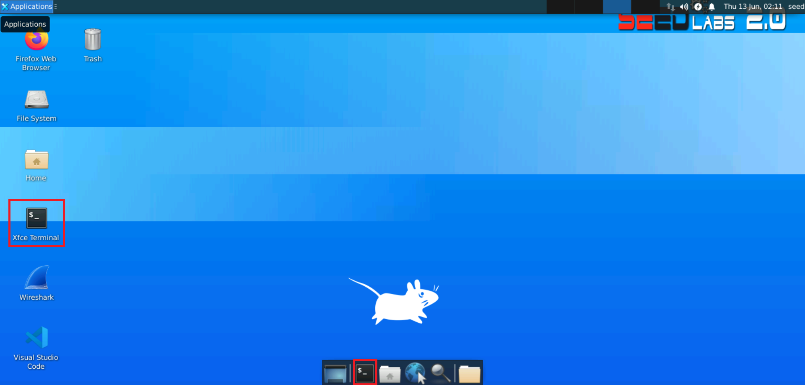
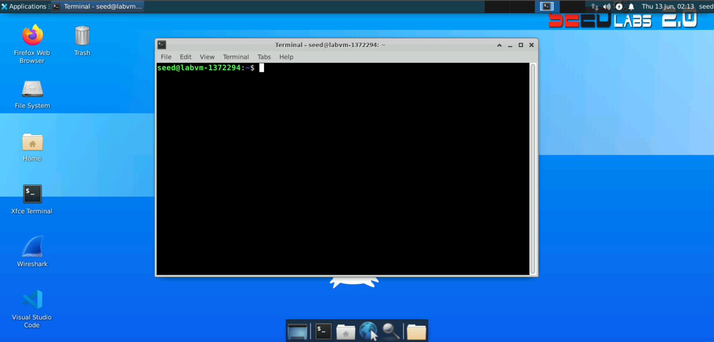
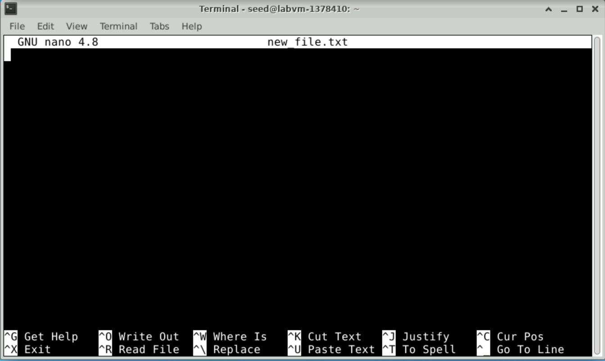

# Lab 1 - Basic Linux Commands

## Lab overview

In this lab, we are going to overview basic Linux commands for extracting information about the machine we are using, main file system operations, and basics of editing a file.

All the commands will be run using the command line interface (CLI). The CLI is a powerful tool for running applications, inspecting the system status, and configuring a machine.

## Lab instructions

### Starting a shell program

1. Open a terminal application. Double click on the terminal application on the desktop.



2. The terminal opens showing the shell prompt as shown below. The shell allows running commands and applications.



To run a command, type a command in the shell and press `<Enter>`. For instance, type `date` in the shell and press `<Enter>`. This runs the date command and displays the date and time of the machine.

<!-- ### Run the `date` command -->

```bash
date
```

**Output** 

```plaintext
Sat Jun 15 00:23:42 UTC 2024
```


### 1. Finding help related to a command

For any given command, you can use the `man` command to print the command manual. For instance:

```bash
man date
```

**Output** 

```plaintext
DATE(1)                          User Commands                         DATE(1)

NAME
       date - print or set the system date and time

SYNOPSIS
       date [OPTION]... [+FORMAT]
       date [-u|--utc|--universal] [MMDDhhmm[[CC]YY][.ss]]

DESCRIPTION
       Display the current time in the given FORMAT, or set the system date.

       Mandatory  arguments  to  long  options are mandatory for short options
       too.

       -d, --date=STRING
              display time described by STRING, not 'now'

       --debug
              annotate the parsed date, and warn about questionable  usage  to
              stderr

       -f, --file=DATEFILE
              like --date; once for each line of DATEFILE

       -I[FMT], --iso-8601[=FMT]
              output  date/time  in ISO 8601 format.  FMT='date' for date only
              (the default), 'hours', 'minutes', 'seconds', or 'ns'  for  date
              and    time    to    the    indicated    precision.     Example:
              2006-08-14T02:34:56-06:00

       -R, --rfc-email
              output date and time in RFC 5322 format.  Example: Mon,  14  Aug
              2006 02:34:56 -0600

       --rfc-3339=FMT
              output  date/time in RFC 3339 format.  FMT='date', 'seconds', or
              'ns' for date and time to  the  indicated  precision.   Example:
              2006-08-14 02:34:56-06:00

       -r, --reference=FILE
              display the last modification time of FILE

       -s, --set=STRING
              set time described by STRING

       -u, --utc, --universal
              print or set Coordinated Universal Time (UTC)

       --help display this help and exit

       --version
              output version information and exit

       FORMAT controls the output.  Interpreted sequences are:

       %%     a literal %

       %a     locale's abbreviated weekday name (e.g., Sun)

       %A     locale's full weekday name (e.g., Sunday)

       %b     locale's abbreviated month name (e.g., Jan)

       %B     locale's full month name (e.g., January)

       %c     locale's date and time (e.g., Thu Mar  3 23:05:25 2005)

       %C     century; like %Y, except omit last two digits (e.g., 20)

       %d     day of month (e.g., 01)

       %D     date; same as %m/%d/%y

       %e     day of month, space padded; same as %_d

       %F     full date; same as %Y-%m-%d

       %g     last two digits of year of ISO week number (see %G)

       %G     year of ISO week number (see %V); normally useful only with %V

       %h     same as %b

       %H     hour (00..23)

       %I     hour (01..12)

       %j     day of year (001..366)

       %k     hour, space padded ( 0..23); same as %_H

       %l     hour, space padded ( 1..12); same as %_I

       %m     month (01..12)

       %M     minute (00..59)

       %n     a newline

       %N     nanoseconds (000000000..999999999)

       %p     locale's equivalent of either AM or PM; blank if not known

       %P     like %p, but lower case

       %q     quarter of year (1..4)

       %r     locale's 12-hour clock time (e.g., 11:11:04 PM)

       %R     24-hour hour and minute; same as %H:%M

       %s     seconds since 1970-01-01 00:00:00 UTC

       %S     second (00..60)

       %t     a tab

       %T     time; same as %H:%M:%S

       %u     day of week (1..7); 1 is Monday

       %U     week number of year, with Sunday as first day of week (00..53)

       %V     ISO week number, with Monday as first day of week (01..53)

       %w     day of week (0..6); 0 is Sunday

       %W     week number of year, with Monday as first day of week (00..53)

       %x     locale's date representation (e.g., 12/31/99)

       %X     locale's time representation (e.g., 23:13:48)

       %y     last two digits of year (00..99)

       %Y     year

       %z     +hhmm numeric time zone (e.g., -0400)

       %:z    +hh:mm numeric time zone (e.g., -04:00)

       %::z   +hh:mm:ss numeric time zone (e.g., -04:00:00)

       %:::z  numeric  time  zone  with  :  to necessary precision (e.g., -04,
              +05:30)

       %Z     alphabetic time zone abbreviation (e.g., EDT)

       By default, date pads numeric fields with zeroes.   The  following  op‐
       tional flags may follow '%':

       -      (hyphen) do not pad the field

       _      (underscore) pad with spaces

       0      (zero) pad with zeros

       ^      use upper case if possible

       #      use opposite case if possible

       After  any  flags  comes  an optional field width, as a decimal number;
       then an optional modifier, which is either E to use the locale's alter‐
       nate  representations  if available, or O to use the locale's alternate
       numeric symbols if available.

EXAMPLES
       Convert seconds since the epoch (1970-01-01 UTC) to a date

              $ date --date='@2147483647'

       Show the time on the west coast of the US (use tzselect(1) to find TZ)

              $ TZ='America/Los_Angeles' date

       Show the local time for 9AM next Friday on the west coast of the US

              $ date --date='TZ="America/Los_Angeles" 09:00 next Fri'

DATE STRING
       The --date=STRING is a mostly free format human  readable  date  string
       such  as  "Sun, 29 Feb 2004 16:21:42 -0800" or "2004-02-29 16:21:42" or
       even "next Thursday".  A date string may contain items indicating  cal‐
       endar  date,  time of day, time zone, day of week, relative time, rela‐
       tive date, and numbers.  An empty string indicates the beginning of the
       day.   The date string format is more complex than is easily documented
       here but is fully described in the info documentation.

AUTHOR
       Written by David MacKenzie.

REPORTING BUGS
       GNU coreutils online help: <https://www.gnu.org/software/coreutils/>
       Report date translation bugs to <https://translationproject.org/team/>

COPYRIGHT
       Copyright © 2018 Free Software Foundation, Inc.   License  GPLv3+:  GNU
       GPL version 3 or later <https://gnu.org/licenses/gpl.html>.
       This  is  free  software:  you  are free to change and redistribute it.
       There is NO WARRANTY, to the extent permitted by law.

SEE ALSO
       Full documentation at: <https://www.gnu.org/software/coreutils/date>
       or available locally via: info '(coreutils) date invocation'

GNU coreutils 8.30              September 2019                         DATE(1)
```

This prints the manual for the date command. The manual usually does not fit on one screen. You have the following options:

+ Press `<Enter>` to scroll one line down.
+ Press `<Space>` to scroll one page of text down.
+ Press `<q>` to exit the manual.  

### 2. Running commands as a superuser

To run commands as a superuser, you need to use `sudo`. The `sudo` command allows you to execute a single command with superuser (root) privileges. This is useful for performing administrative tasks that require higher permissions than those of a regular user.

For instance, the following command runs `ls` (which lists directory contents) with superuser mode:

```bash
sudo ls
```

**Output** 

```plaintext
Desktop    Downloads  Pictures	Templates  thinclient_drives
Documents  Music      Public	Videos
```

> [!CAUTION]
> Using `sudo` runs commands in superuser mode, which allows the command that is executed to change critical configurations and files in the operating system.
> Consequently, best practice for using superuser mode is:
> + Limit the use of the superuser mode to the bare minimum commands that need superuser privileges
> + Only run commands that you trust and fully understand

### 3. Extracting machine information

Several common Linux commands help us extract information about the machine.

#### 3.1 Finding the OS version information
The file `/etc/os-release` contains the operating system information. We can use the `cat` command to print the file content as follows:

```bash
cat /etc/os-release
```

**Output** 

```plaintext
NAME="Ubuntu"
VERSION="20.04.6 LTS (Focal Fossa)"
ID=ubuntu
ID_LIKE=debian
PRETTY_NAME="Ubuntu 20.04.6 LTS"
VERSION_ID="20.04"
HOME_URL="https://www.ubuntu.com/"
SUPPORT_URL="https://help.ubuntu.com/"
BUG_REPORT_URL="https://bugs.launchpad.net/ubuntu/"
PRIVACY_POLICY_URL="https://www.ubuntu.com/legal/terms-and-policies/privacy-policy"
VERSION_CODENAME=focal
UBUNTU_CODENAME=focal
```

This output shows that the machine is running a Ubuntu OS system version 20.04.6

#### 3.2 Finding the CPU information
To find the CPU information, you can use the `lscpu` command.

```bash
lscpu
```

**Output** 

```plaintext
Architecture:                       x86_64
CPU op-mode(s):                     32-bit, 64-bit
Byte Order:                         Little Endian
Address sizes:                      46 bits physical, 48 bits virtual
CPU(s):                             2
On-line CPU(s) list:                0,1
Thread(s) per core:                 1
Core(s) per socket:                 2
Socket(s):                          1
NUMA node(s):                       1
Vendor ID:                          GenuineIntel
CPU family:                         6
Model:                              85
Model name:                         Intel(R) Xeon(R) Platinum 8272CL CPU @ 2.60G
                                    Hz
Stepping:                           7
CPU MHz:                            2593.908
BogoMIPS:                           5187.81
Hypervisor vendor:                  Microsoft
Virtualization type:                full
L1d cache:                          64 KiB
L1i cache:                          64 KiB
L2 cache:                           2 MiB
L3 cache:                           35.8 MiB
NUMA node0 CPU(s):                  0,1
Vulnerability Gather data sampling: Unknown: Dependent on hypervisor status
Vulnerability Itlb multihit:        KVM: Mitigation: VMX unsupported
Vulnerability L1tf:                 Mitigation; PTE Inversion
Vulnerability Mds:                  Mitigation; Clear CPU buffers; SMT Host stat
                                    e unknown
Vulnerability Meltdown:             Mitigation; PTI
Vulnerability Mmio stale data:      Vulnerable: Clear CPU buffers attempted, no 
                                    microcode; SMT Host state unknown
Vulnerability Retbleed:             Vulnerable
Vulnerability Spec store bypass:    Vulnerable
Vulnerability Spectre v1:           Mitigation; usercopy/swapgs barriers and __u
                                    ser pointer sanitization
Vulnerability Spectre v2:           Mitigation; Retpolines, STIBP disabled, RSB 
                                    filling, PBRSB-eIBRS Not affected
Vulnerability Srbds:                Not affected
Vulnerability Tsx async abort:      Mitigation; Clear CPU buffers; SMT Host stat
                                    e unknown
Flags:                              fpu vme de pse tsc msr pae mce cx8 apic sep 
                                    mtrr pge mca cmov pat pse36 clflush mmx fxsr
                                     sse sse2 ss ht syscall nx pdpe1gb rdtscp lm
                                     constant_tsc rep_good nopl xtopology cpuid 
                                    pni pclmulqdq ssse3 fma cx16 pcid sse4_1 sse
                                    4_2 movbe popcnt aes xsave avx f16c rdrand h
                                    ypervisor lahf_lm abm 3dnowprefetch invpcid_
                                    single pti fsgsbase bmi1 hle avx2 smep bmi2 
                                    erms invpcid rtm avx512f avx512dq rdseed adx
                                     smap clflushopt avx512cd avx512bw avx512vl 
                                    xsaveopt xsavec xsaves md_clear
```

The output of this command shows that this machine has an intel Intel(R) Xeon(R) Platinum 8272CL CPU @ 2.60GHz

#### 3.3 Finding the memory information
To find information about the memory system in a machine and stats about its usage you can read the `/proc/meminfo` file

```bash
less  /proc/meminfo
```
The `less` command prints the file `/proc/meminfo` one page at a time.
The file `/proc/meminfo` contains information about the memory configuration and its usage.

**Output**

```plaintext
MemTotal:        4007988 kB
MemFree:         2610804 kB
MemAvailable:    3079076 kB
Buffers:           35736 kB
Cached:           635200 kB
SwapCached:            0 kB
Active:           161660 kB
Inactive:        1005704 kB
Active(anon):       1292 kB
Inactive(anon):   512536 kB
Active(file):     160368 kB
Inactive(file):   493168 kB
Unevictable:       21672 kB
Mlocked:           18600 kB
SwapTotal:             0 kB
SwapFree:              0 kB
Dirty:              1668 kB
Writeback:             0 kB
AnonPages:        498844 kB
Mapped:           278692 kB
Shmem:              9196 kB
KReclaimable:      54620 kB
Slab:             108852 kB
SReclaimable:      54620 kB
SUnreclaim:        54232 kB
KernelStack:        6588 kB
PageTables:        10956 kB
NFS_Unstable:          0 kB
Bounce:                0 kB
WritebackTmp:          0 kB
CommitLimit:     2003992 kB
Committed_AS:    2877440 kB
VmallocTotal:   34359738367 kB
VmallocUsed:       36476 kB
VmallocChunk:          0 kB
Percpu:             2136 kB
HardwareCorrupted:     0 kB
AnonHugePages:    133120 kB
ShmemHugePages:        0 kB
ShmemPmdMapped:        0 kB
FileHugePages:         0 kB
FilePmdMapped:         0 kB
HugePages_Total:       0
HugePages_Free:        0
HugePages_Rsvd:        0
HugePages_Surp:        0
Hugepagesize:       2048 kB
Hugetlb:               0 kB
DirectMap4k:      118720 kB
DirectMap2M:     3026944 kB
DirectMap1G:     3145728 kB
~
```

The output shows that this machine has close to 4 GB of memory. Around 2.6 GB is free.

#### 3.4 Processes management 

To find information about the processes running on an operating system, you can use `ps` or `top`.
`ps` is the command to check the process status. The command offers a number of options to display details about processes.

```bash
ps
```

**Output**
```plaintext
    PID TTY          TIME CMD
   1991 pts/0    00:00:00 bash
   3356 pts/0    00:00:00 ps
```

The output shows the processes that are run by the current user.
The `ps -e -f` command is a variation of the `ps` command in Linux that allows you to display a list of all the processes running on your Linux system in a more detailed format. It provides a full-process listing that includes information such as the process owner, parent process ID, and start time.

```bash
ps -e -f
```

**Output**
```plaintext
UID          PID    PPID  C STIME TTY          TIME CMD
root           1       0  1 23:30 ?        00:00:02 /sbin/init
root           2       0  0 23:30 ?        00:00:00 [kthreadd]
root           3       2  0 23:30 ?        00:00:00 [rcu_gp]
root           4       2  0 23:30 ?        00:00:00 [rcu_par_gp]
root           5       2  0 23:30 ?        00:00:00 [slub_flushwq]
root           6       2  0 23:30 ?        00:00:00 [netns]
root           7       2  0 23:30 ?        00:00:00 [kworker/0:0-events]
root           8       2  0 23:30 ?        00:00:00 [kworker/0:0H-events_highpri
root           9       2  0 23:30 ?        00:00:00 [kworker/u4:0-ext4-rsv-conve
root          10       2  0 23:30 ?        00:00:00 [mm_percpu_wq]
root          11       2  0 23:30 ?        00:00:00 [rcu_tasks_rude_]
root          12       2  0 23:30 ?        00:00:00 [rcu_tasks_trace]
root          13       2  0 23:30 ?        00:00:00 [ksoftirqd/0]
root          14       2  0 23:30 ?        00:00:00 [rcu_sched]
root          15       2  0 23:30 ?        00:00:00 [migration/0]
root          16       2  0 23:30 ?        00:00:00 [kworker/0:1-cgroup_destroy]
root          17       2  0 23:30 ?        00:00:00 [cpuhp/0]
root          18       2  0 23:30 ?        00:00:00 [cpuhp/1]
root          19       2  0 23:30 ?        00:00:00 [migration/1]
root          20       2  0 23:30 ?        00:00:00 [ksoftirqd/1]
root          21       2  0 23:30 ?        00:00:00 [kworker/1:0-cgroup_destroy]
root          22       2  0 23:30 ?        00:00:00 [kworker/1:0H-events_highpri
root          23       2  0 23:30 ?        00:00:00 [kdevtmpfs]
root          24       2  0 23:30 ?        00:00:00 [inet_frag_wq]
root          25       2  0 23:30 ?        00:00:00 [kauditd]
root          26       2  0 23:30 ?        00:00:00 [khungtaskd]
root          27       2  0 23:30 ?        00:00:00 [oom_reaper]
root          28       2  0 23:30 ?        00:00:00 [writeback]
root          29       2  0 23:30 ?        00:00:00 [kcompactd0]
root          30       2  0 23:30 ?        00:00:00 [ksmd]
root          31       2  0 23:30 ?        00:00:00 [khugepaged]
root          36       2  0 23:30 ?        00:00:01 [kworker/1:1-events]
root          78       2  0 23:30 ?        00:00:00 [kintegrityd]
root          79       2  0 23:30 ?        00:00:00 [kblockd]
root          80       2  0 23:30 ?        00:00:00 [blkcg_punt_bio]
root          81       2  0 23:30 ?        00:00:00 [tpm_dev_wq]
root          82       2  0 23:30 ?        00:00:00 [ata_sff]
root          83       2  0 23:30 ?        00:00:00 [md]
root          84       2  0 23:30 ?        00:00:00 [edac-poller]
root          85       2  0 23:30 ?        00:00:00 [hv_vmbus_con]
root          86       2  0 23:30 ?        00:00:00 [hv_pri_chan]
root          87       2  0 23:30 ?        00:00:00 [hv_sub_chan]
root          88       2  0 23:30 ?        00:00:00 [devfreq_wq]
root          89       2  0 23:30 ?        00:00:00 [watchdogd]
root          90       2  0 23:30 ?        00:00:00 [kworker/u4:1-events_unbound
root          91       2  0 23:30 ?        00:00:00 [kworker/1:1H-kblockd]
root          93       2  0 23:30 ?        00:00:00 [kswapd0]
root          94       2  0 23:30 ?        00:00:00 [ecryptfs-kthrea]
root          96       2  0 23:30 ?        00:00:00 [kthrotld]
root          97       2  0 23:30 ?        00:00:00 [nfit]
root          98       2  0 23:30 ?        00:00:00 [nvme-wq]
root          99       2  0 23:30 ?        00:00:00 [kworker/u4:2-events_unbound
root         100       2  0 23:30 ?        00:00:00 [scsi_eh_0]
root         101       2  0 23:30 ?        00:00:00 [scsi_eh_1]
root         102       2  0 23:30 ?        00:00:00 [scsi_tmf_0]
root         103       2  0 23:30 ?        00:00:00 [kworker/u4:3-events_unbound
root         104       2  0 23:30 ?        00:00:00 [scsi_tmf_1]
root         105       2  0 23:30 ?        00:00:00 [nvme-reset-wq]
root         106       2  0 23:30 ?        00:00:00 [nvme-delete-wq]
root         107       2  0 23:30 ?        00:00:00 [scsi_eh_2]
root         108       2  0 23:30 ?        00:00:00 [kworker/u4:4-events_unbound
root         109       2  0 23:30 ?        00:00:00 [scsi_eh_3]
root         110       2  0 23:30 ?        00:00:00 [scsi_tmf_2]
root         111       2  0 23:30 ?        00:00:00 [scsi_tmf_3]
root         112       2  0 23:30 ?        00:00:00 [scsi_eh_4]
root         113       2  0 23:30 ?        00:00:00 [scsi_tmf_4]
root         114       2  0 23:30 ?        00:00:00 [scsi_eh_5]
root         115       2  0 23:30 ?        00:00:00 [scsi_tmf_5]
root         116       2  0 23:30 ?        00:00:00 [kworker/u4:5-events_unbound
root         117       2  0 23:30 ?        00:00:00 [kworker/u4:6-writeback]
root         118       2  0 23:30 ?        00:00:00 [kworker/u4:7-ext4-rsv-conve
root         119       2  0 23:30 ?        00:00:00 [vfio-irqfd-clea]
root         120       2  0 23:30 ?        00:00:00 [kworker/u4:8]
root         121       2  0 23:30 ?        00:00:00 [mld]
root         122       2  0 23:30 ?        00:00:00 [kworker/0:1H-kblockd]
root         123       2  0 23:30 ?        00:00:00 [hv_balloon]
root         124       2  0 23:30 ?        00:00:00 [ipv6_addrconf]
root         133       2  0 23:30 ?        00:00:00 [kstrp]
root         136       2  0 23:30 ?        00:00:00 [zswap-shrink]
root         137       2  0 23:30 ?        00:00:00 [kworker/u5:0]
root         142       2  0 23:30 ?        00:00:00 [jbd2/sdb1-8]
root         143       2  0 23:30 ?        00:00:00 [ext4-rsv-conver]
root         183       1  0 23:30 ?        00:00:00 /lib/systemd/systemd-journal
root         202       2  0 23:30 ?        00:00:00 [kworker/0:2-rcu_gp]
root         210       2  0 23:30 ?        00:00:00 [kworker/1:2-cgroup_destroy]
root         228       1  0 23:30 ?        00:00:00 /lib/systemd/systemd-udevd
root         256       2  0 23:30 ?        00:00:00 [cryptd]
root         298       1  0 23:30 ?        00:00:00 /usr/lib/linux-tools/5.15.0-
root         336       2  0 23:30 ?        00:00:00 [kworker/1:3-events]
root         377       2  0 23:30 ?        00:00:00 bpfilter_umh
root         430       2  0 23:30 ?        00:00:00 [kaluad]
root         431       2  0 23:30 ?        00:00:00 [kmpath_rdacd]
root         432       2  0 23:30 ?        00:00:00 [kmpathd]
root         433       2  0 23:30 ?        00:00:00 [kmpath_handlerd]
root         434       1  0 23:30 ?        00:00:00 /sbin/multipathd -d -s
root         474       2  0 23:30 ?        00:00:00 [kworker/1:4-events]
systemd+     563       1  0 23:30 ?        00:00:00 /lib/systemd/systemd-network
systemd+     565       1  0 23:30 ?        00:00:00 /lib/systemd/systemd-resolve
root         638       2  0 23:30 ?        00:00:00 [jbd2/sda1-8]
root         639       2  0 23:30 ?        00:00:00 [ext4-rsv-conver]
root         682       1  0 23:30 ?        00:00:00 /usr/lib/accountsservice/acc
avahi        683       1  0 23:30 ?        00:00:00 avahi-daemon: running [labvm
root         685       1  0 23:30 ?        00:00:00 /usr/sbin/cupsd -l
message+     687       1  0 23:30 ?        00:00:00 /usr/bin/dbus-daemon --syste
root         688       1  0 23:30 ?        00:00:00 /usr/sbin/NetworkManager --n
root         693       1  0 23:30 ?        00:00:00 /usr/sbin/irqbalance --foreg
root         697       1  0 23:30 ?        00:00:00 /usr/bin/python3 /usr/bin/ne
root         699       1  0 23:30 ?        00:00:00 /usr/lib/policykit-1/polkitd
syslog       706       1  0 23:30 ?        00:00:00 /usr/sbin/rsyslogd -n -iNONE
root         707       1  0 23:30 ?        00:00:00 /usr/lib/snapd/snapd
root         708       1  0 23:30 ?        00:00:00 /usr/libexec/switcheroo-cont
root         714       1  0 23:30 ?        00:00:00 /lib/systemd/systemd-logind
root         715       1  0 23:30 ?        00:00:00 /usr/lib/udisks2/udisksd
root         716       1  0 23:30 ?        00:00:00 /sbin/wpa_supplicant -u -s -
avahi        719     683  0 23:30 ?        00:00:00 avahi-daemon: chroot helper
root         731       1  0 23:30 ?        00:00:00 /usr/sbin/cups-browsed
root         746       1  0 23:30 ?        00:00:00 /usr/sbin/ModemManager
root         786       1  0 23:30 ?        00:00:00 /usr/bin/python3 /usr/share/
root         809       1  0 23:30 ?        00:00:00 /usr/bin/containerd
_chrony      815       1  0 23:30 ?        00:00:00 /usr/sbin/chronyd -F -1
_chrony      818     815  0 23:30 ?        00:00:00 /usr/sbin/chronyd -F -1
root         833       1  0 23:30 ?        00:00:00 /usr/sbin/inetd
root         838       1  0 23:30 ?        00:00:00 /usr/sbin/xrdp-sesman
root         843       1  0 23:30 ?        00:00:00 /usr/sbin/cron -f
root         856       1  0 23:30 ?        00:00:00 /usr/bin/python3 -u /usr/sbi
daemon       860       1  0 23:30 ?        00:00:00 /usr/sbin/atd -f
root         877       1  0 23:30 ttyS0    00:00:00 /sbin/agetty -o -p -- \u --k
root         891       1  0 23:30 tty1     00:00:00 /sbin/agetty -o -p -- \u --n
root         936       1  0 23:30 ?        00:00:00 sshd: /usr/sbin/sshd -D [lis
xrdp         952       1  0 23:30 ?        00:00:00 /usr/sbin/xrdp
root        1042       1  0 23:30 ?        00:00:00 /usr/sbin/apache2 -k start
www-data    1043    1042  0 23:30 ?        00:00:00 /usr/sbin/apache2 -k start
www-data    1044    1042  0 23:30 ?        00:00:00 /usr/sbin/apache2 -k start
root        1137       1  0 23:30 ?        00:00:00 /usr/bin/dockerd -H fd:// --
root        1303       2  0 23:30 ?        00:00:00 [kworker/0:3-events]
root        1329     856  0 23:30 ?        00:00:00 python3 -u bin/WALinuxAgent-
root        1587       2  0 23:30 ?        00:00:00 [kworker/1:5-events]
xrdp        1657     952  1 23:32 ?        00:00:00 /usr/sbin/xrdp
root        1658     838  0 23:32 ?        00:00:00 /usr/sbin/xrdp-sesman
seed        1660       1  0 23:32 ?        00:00:00 /lib/systemd/systemd --user
seed        1661    1660  0 23:32 ?        00:00:00 (sd-pam)
seed        1666    1660  0 23:32 ?        00:00:00 /usr/bin/pulseaudio --daemon
seed        1667    1658  0 23:32 ?        00:00:00 /bin/bash /home/seed/.xsessi
seed        1668    1658  1 23:32 ?        00:00:00 /usr/lib/xorg/Xorg :10 -auth
seed        1671    1658  0 23:32 ?        00:00:00 /usr/sbin/xrdp-chansrv
seed        1688    1660  0 23:32 ?        00:00:00 /usr/bin/dbus-daemon --sessi
rtkit       1695       1  0 23:32 ?        00:00:00 /usr/libexec/rtkit-daemon
seed        1730    1667  0 23:32 ?        00:00:00 /usr/bin/ssh-agent /usr/bin/
seed        1739    1667  0 23:32 ?        00:00:00 xfce4-session
seed        1740    1660  0 23:32 ?        00:00:00 /usr/libexec/at-spi-bus-laun
seed        1745    1740  0 23:32 ?        00:00:00 /usr/bin/dbus-daemon --confi
seed        1749    1660  0 23:32 ?        00:00:00 /usr/lib/x86_64-linux-gnu/xf
seed        1755    1660  0 23:32 ?        00:00:00 /usr/libexec/at-spi2-registr
seed        1761    1660  0 23:32 ?        00:00:00 /usr/bin/gpg-agent --supervi
seed        1763    1739  0 23:32 ?        00:00:00 xfwm4
seed        1766    1660  0 23:32 ?        00:00:00 /usr/libexec/gvfsd
seed        1778       1  0 23:32 ?        00:00:00 xfsettingsd
seed        1779    1739  0 23:32 ?        00:00:00 xfce4-panel
root        1782       1  0 23:32 ?        00:00:00 /usr/lib/upower/upowerd
seed        1790    1739  0 23:32 ?        00:00:00 Thunar --daemon
seed        1795    1739  1 23:32 ?        00:00:00 xfdesktop
seed        1799    1660  0 23:32 ?        00:00:00 /usr/lib/x86_64-linux-gnu/tu
seed        1809    1739  0 23:32 ?        00:00:00 /usr/bin/python3 /usr/share/
seed        1819    1739  0 23:32 ?        00:00:00 /usr/libexec/evolution-data-
seed        1825       1  0 23:32 ?        00:00:00 xfce4-power-manager
seed        1829    1739  0 23:32 ?        00:00:00 xiccd
seed        1830    1739  0 23:32 ?        00:00:00 nm-applet
seed        1834    1739  0 23:32 ?        00:00:00 /usr/libexec/geoclue-2.0/dem
colord      1841       1  0 23:32 ?        00:00:00 /usr/libexec/colord
seed        1843    1660  0 23:32 ?        00:00:00 /usr/lib/x86_64-linux-gnu/xf
seed        1848    1660  0 23:32 ?        00:00:00 /usr/libexec/dconf-service
seed        1858    1779  0 23:32 ?        00:00:00 /usr/lib/x86_64-linux-gnu/xf
seed        1861    1779  0 23:32 ?        00:00:00 /usr/lib/x86_64-linux-gnu/xf
seed        1862    1779  0 23:32 ?        00:00:00 /usr/lib/x86_64-linux-gnu/xf
seed        1865    1779  0 23:32 ?        00:00:00 /usr/lib/x86_64-linux-gnu/xf
seed        1866    1779  0 23:32 ?        00:00:00 /usr/lib/x86_64-linux-gnu/xf
seed        1884    1660  0 23:32 ?        00:00:00 /usr/libexec/gvfs-udisks2-vo
seed        1890    1660  0 23:32 ?        00:00:00 /usr/libexec/gvfs-goa-volume
seed        1907    1660  0 23:32 ?        00:00:00 /usr/libexec/goa-daemon
seed        1915    1660  0 23:32 ?        00:00:00 /usr/libexec/goa-identity-se
seed        1917    1660  0 23:32 ?        00:00:00 /usr/libexec/gvfs-mtp-volume
seed        1921    1660  0 23:32 ?        00:00:00 /usr/libexec/gvfs-afc-volume
seed        1931    1660  0 23:32 ?        00:00:00 /usr/libexec/evolution-sourc
seed        1936    1660  0 23:32 ?        00:00:00 /usr/libexec/gvfs-gphoto2-vo
seed        1947    1766  0 23:32 ?        00:00:00 /usr/libexec/gvfsd-trash --s
seed        1953    1660  0 23:32 ?        00:00:00 /usr/libexec/gvfsd-metadata
seed        1957    1660  0 23:32 ?        00:00:00 /usr/libexec/evolution-calen
seed        1966    1660  0 23:32 ?        00:00:00 /usr/libexec/evolution-addre
seed        1986    1790  0 23:32 ?        00:00:00 xfce4-terminal
seed        1991    1986  0 23:32 pts/0    00:00:00 bash
seed        1999    1991  0 23:32 pts/0    00:00:00 ps -e -f
```

A second common command for monitoring processes on a machine is `top`.
It provides a dynamic real-time view of the running system. Usually, this command shows the system's summary information and the list of processes running. As soon as you run this command, it will open an interactive command mode. The top half portion contains the statistics of processes and resource usage, and the lower half contains a list of the currently running processes. Pressing `q` will simply exit the command mode.

```bash
top
```

**Output**

```plaintext
top - 19:19:17 up 54 min,  0 users,  load average: 0.00, 0.01, 0.00
Tasks: 178 total,   1 running, 177 sleeping,   0 stopped,   0 zombie
%Cpu(s):  1.7 us,  0.7 sy,  0.0 ni, 97.3 id,  0.3 wa,  0.0 hi,  0.0 si,  0.0 st
MiB Mem :   3914.1 total,   1273.8 free,    737.4 used,   1902.9 buff/cache
MiB Swap:      0.0 total,      0.0 free,      0.0 used.   2899.0 avail Mem 

    PID USER      PR  NI    VIRT    RES    SHR S  %CPU  %MEM     TIME+ COMMAND                                               
   3738 xrdp      20   0   30168  24768   8760 S   2.3   0.6   0:04.18 xrdp                                                  
   1835 seed      20   0  374264 146944  57192 S   1.7   3.7   0:08.11 Xorg                                                  
   2916 seed      20   0  396940  46652  34956 S   1.3   1.2   0:03.21 xfce4-terminal                                        
   1855 seed      20   0    7900   4868   3936 S   0.3   0.1   0:00.73 dbus-daemon                                           
   1930 seed      20   0  758704  91496  60948 S   0.3   2.3   0:01.52 xfwm4                                                 
   2012 seed      20   0  506212  38388  31048 S   0.3   1.0   0:02.29 panel-8-pulseau                                       
      1 root      20   0  104384  13456   8592 S   0.0   0.3   0:07.19 systemd                                               
      2 root      20   0       0      0      0 S   0.0   0.0   0:00.01 kthreadd                                              
      3 root       0 -20       0      0      0 I   0.0   0.0   0:00.00 rcu_gp                                                
      4 root       0 -20       0      0      0 I   0.0   0.0   0:00.00 rcu_par_gp                                            
      5 root       0 -20       0      0      0 I   0.0   0.0   0:00.00 slub_flushwq                                          
      6 root       0 -20       0      0      0 I   0.0   0.0   0:00.00 netns                                                 
      8 root       0 -20       0      0      0 I   0.0   0.0   0:00.00 kworker/0:0H-events_highpri                           
     10 root       0 -20       0      0      0 I   0.0   0.0   0:00.00 mm_percpu_wq                                          
     11 root      20   0       0      0      0 S   0.0   0.0   0:00.00 rcu_tasks_rude_                                       
     12 root      20   0       0      0      0 S   0.0   0.0   0:00.00 rcu_tasks_trace                                       
     13 root      20   0       0      0      0 S   0.0   0.0   0:00.15 ksoftirqd/0                                           
     14 root      20   0       0      0      0 I   0.0   0.0   0:00.48 rcu_sched                                             
     15 root      rt   0       0      0      0 S   0.0   0.0   0:00.11 migration/0                                           
     17 root      20   0       0      0      0 S   0.0   0.0   0:00.00 cpuhp/0                                               
     18 root      20   0       0      0      0 S   0.0   0.0   0:00.00 cpuhp/1                                               
     19 root      rt   0       0      0      0 S   0.0   0.0   0:00.69 migration/1                                           
     20 root      20   0       0      0      0 S   0.0   0.0   0:00.19 ksoftirqd/1                                           
     22 root       0 -20       0      0      0 I   0.0   0.0   0:00.00 kworker/1:0H                                          
     23 root      20   0       0      0      0 S   0.0   0.0   0:00.00 kdevtmpfs                                             
     24 root       0 -20       0      0      0 I   0.0   0.0   0:00.00 inet_frag_wq                                          
     25 root      20   0       0      0      0 S   0.0   0.0   0:00.00 kauditd                                               
     26 root      20   0       0      0      0 S   0.0   0.0   0:00.00 khungtaskd                                            
     27 root      20   0       0      0      0 S   0.0   0.0   0:00.00 oom_reaper                                            
     28 root       0 -20       0      0      0 I   0.0   0.0   0:00.00 writeback                                             
     29 root      20   0       0      0      0 S   0.0   0.0   0:00.13 kcompactd0                                            
     30 root      25   5       0      0      0 S   0.0   0.0   0:00.00 ksmd                                                  
     31 root      39  19       0      0      0 S   0.0   0.0   0:00.09 khugepaged                                            
     78 root       0 -20       0      0      0 I   0.0   0.0   0:00.00 kintegrityd                                           
     79 root       0 -20       0      0      0 I   0.0   0.0   0:00.00 kblockd                                               
     80 root       0 -20       0      0      0 I   0.0   0.0   0:00.00 blkcg_punt_bio                                        
     81 root       0 -20       0      0      0 I   0.0   0.0   0:00.00 tpm_dev_wq                                            
     82 root       0 -20       0      0      0 I   0.0   0.0   0:00.00 ata_sff                                               
     83 root       0 -20       0      0      0 I   0.0   0.0   0:00.00 md                                                    
     84 root       0 -20       0      0      0 I   0.0   0.0   0:00.00 edac-poller                                           
     85 root       0 -20       0      0      0 I   0.0   0.0   0:00.00 hv_vmbus_con
```

Here is the meaning of the most important columns in the output:
- PID: Shows unique process id.
- VIRT: Total virtual memory used by the task.
- USER: The user name of the owner of the task.
- %CPU: Represents the CPU usage.
- TIME+: CPU Time, the same as ‘TIME’, but reflecting more granularity through hundredths of a second.
- SHR: Represents the Shared Memory size (kb) used by a task.
- %MEM: Shows the Memory usage of a process.
- RES: How much physical RAM the process is using, measured in kilobytes.
- COMMAND: The name of the command that started the process.

#### 3.5 Finding the machine IP address
To find the machine IP address, we can use the `ip` command with the `addr` option.

```bash
ip addr
```
**Output**

```plaintext
1: lo: <LOOPBACK,UP,LOWER_UP> mtu 65536 qdisc noqueue state UNKNOWN group default qlen 1000
    link/loopback 00:00:00:00:00:00 brd 00:00:00:00:00:00
    inet 127.0.0.1/8 scope host lo
       valid_lft forever preferred_lft forever
    inet6 ::1/128 scope host 
       valid_lft forever preferred_lft forever
2: eth0: <BROADCAST,MULTICAST,UP,LOWER_UP> mtu 1500 qdisc mq state UP group default qlen 1000
    link/ether 00:0d:3a:f4:24:fe brd ff:ff:ff:ff:ff:ff
    **inet 10.0.0.4**/24 brd 10.0.0.255 scope global eth0
       valid_lft forever preferred_lft forever
    inet6 fe80::20d:3aff:fef4:24fe/64 scope link 
       valid_lft forever preferred_lft forever
3: docker0: <NO-CARRIER,BROADCAST,MULTICAST,UP> mtu 1500 qdisc noqueue state DOWN group default 
    link/ether 02:42:71:62:d9:f4 brd ff:ff:ff:ff:ff:ff
    inet 172.17.0.1/16 brd 172.17.255.255 scope global docker0
       valid_lft forever preferred_lft forever
```
The command prints the ip address of every interface in the system. The lo interface is a local interface and always has an ip address of 127.0.0.1.
The command shows that this machine has the ip address of 10.0.0.4


### 4. Basic file system commands

The Linux files and directories are organized in a directory tree. Each directory can contain files or other directories.

#### 4.1 Finding the current working directory
To find the current working directory, use the `pwd` command.

```bash
pwd
```  

**Output** 

```plaintext
/home/seed
```

#### 4.2 Listing directories and files
The `ls` command lists all directories and files in the current directory.

```bash
ls
```

**Output** 
```plaintext
Desktop    Downloads  Pictures  Templates  thinclient_drives
Documents  Music      Public    Videos
```

#### 4.3 Changing a directory
To change a directory, use the `cd` command followed by the directory name.

```bash
cd <directory_name>
```

The `cd ~` command returns the prompt to the home directory of the user.

```bash
cd ~
```

#### 4.4 Creating a directory
To create a directory, use the `mkdir` command.

```bash
mkdir newDir
```

You can confirm that "newDir" was created by running the `ls` command

```bash
ls
```

**Output** 

```plaintext
Desktop    Downloads  Pictures  Templates  newDir
Documents  Music      Public    Videos     thinclient_drives
```

`cd` will change the working directory to `newDir`. `pwd` should confirm that.

```bash
cd newDir
```

```bash
pwd
```

**Output** 

```plaintext
/home/seed/newDir
```


#### 4.5 Creating and reading a file
There are many commands for creating and editing a text file from within the terminal. The easiest one to learn is `nano`.

```bash
nano new_file.txt
```

This command will create a `new_file.txt` if it does not exist, and will open it for editing if it already exists.
The `nano` command opens the file for editing.



At the bottom of the nano window are the available nano commands. ^ means ctrl.
So you can write in the file something like “this is a test”
Then press `<ctrl+x>` to exit
When asked, press `<y>` to save the changes.
Press `<enter>` to confirm the file name.

Use `ls` to confirm that the new file is created.

```bash
ls
```

**Output** 

```plaintext
Desktop    Downloads  Pictures  Templates  newDir        thinclient_drives
Documents  Music      Public    Videos     new_file.txt
```

You can use one of the following commands to print the content of a file

```bash
more new_file.txt
```

or 

```bash
cat new_file.txt
```
or

```bash
less new_file.txt
```

**Output** 

```plaintext
this is a test
```

#### 4.6 Managing files

Use `cp` to copy a file.

```bash
cp new_file.txt copy_file.txt
ls
```
This command copies the file `new_file.txt` to a new file `copy_file.txt`
Use `ls` to verify that the file is copied.


**Output** 

```plaintext
Desktop    Downloads  Pictures  Templates  copy_file.txt  new_file.txt
Documents  Music      Public    Videos     newDir         thinclient_drives
```

You can see that you have two files now: `new_file.txt` and `copy_file.txt`

To delete a file use the `rm` command

```bash
rm new_file.txt
```

Deletes the new_file.txt

Use `ls` to verify that the file is deleted.

**Output** 

```plaintext
Desktop    Downloads  Pictures  Templates  copy_file.txt  thinclient_drives
Documents  Music      Public    Videos     newDir
```

#### 4.7	Save the Command History to a File
You can save the command history to a file by running the following command:

```bash
history > ~/my_history.txt
```


#### 4.8	Verify the History File
Check the history file you created using the following command to view the history file

```bash
cat ~/my_history.txt
```

#### 4.9	Terminate the Shell Session
Run the following command to exit the shell session

```bash
exit
```

#### Additional Resources
Here is a [cheat sheet](../Linux_cheat_sheet.pdf) of common Linux commands. 


### You successfully completed the Lab
