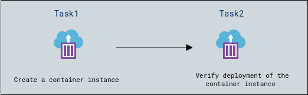
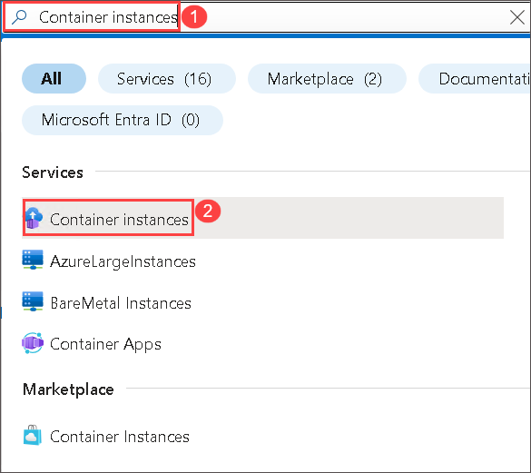
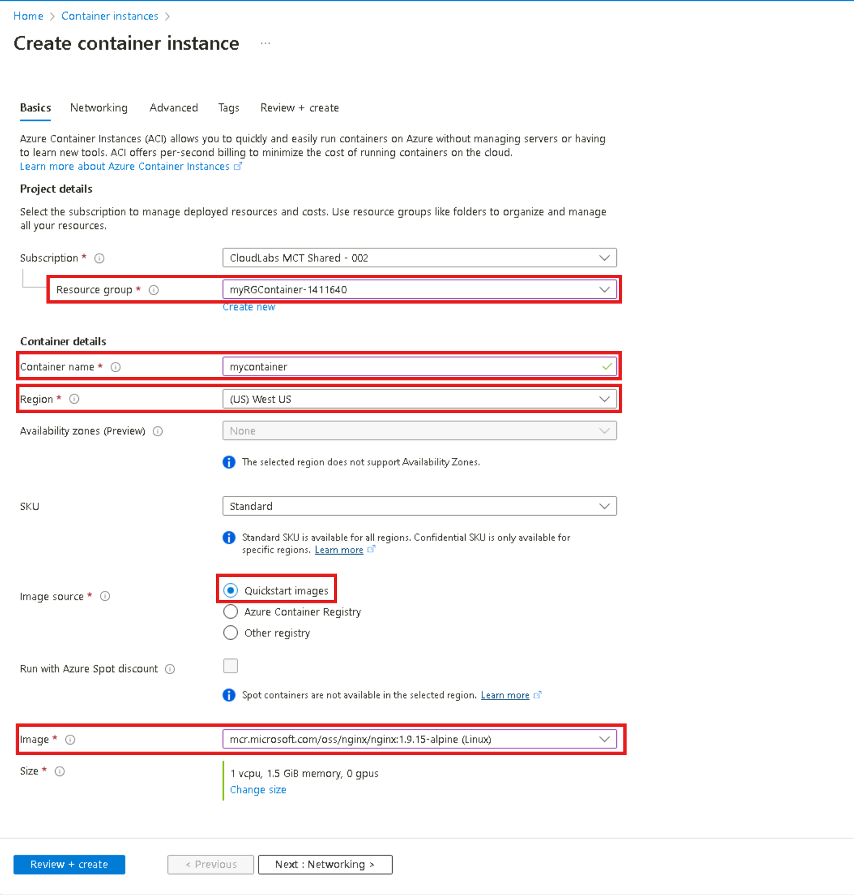
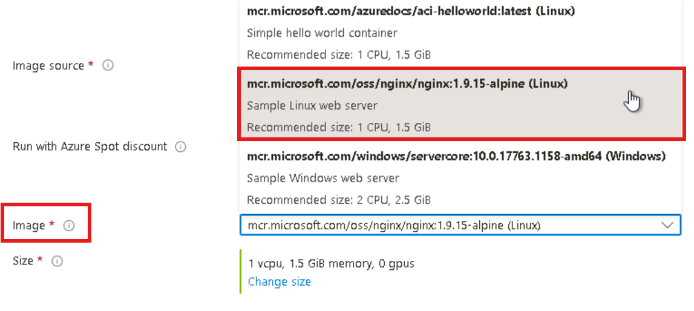
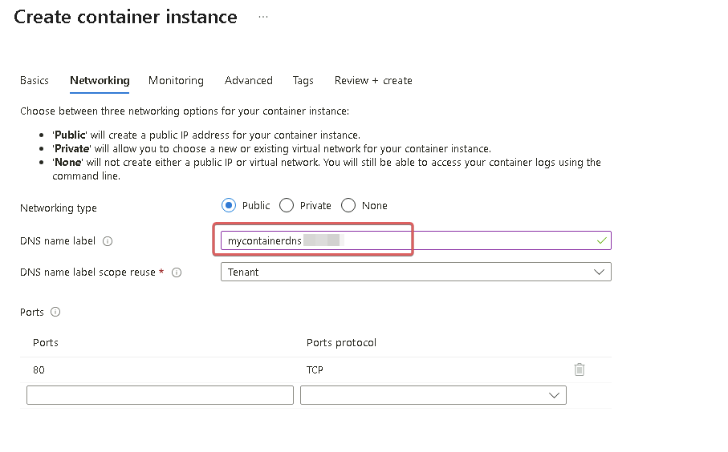
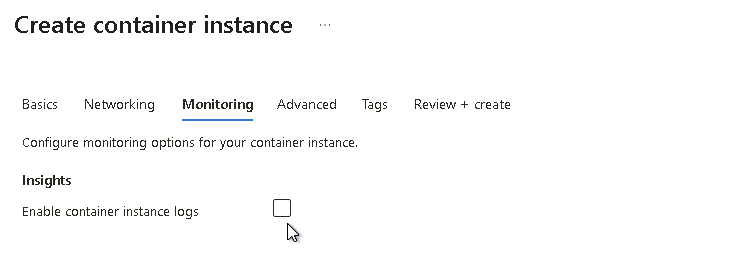
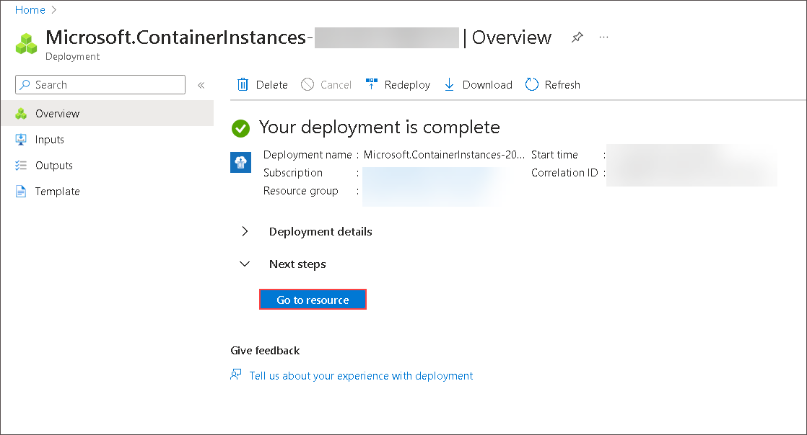
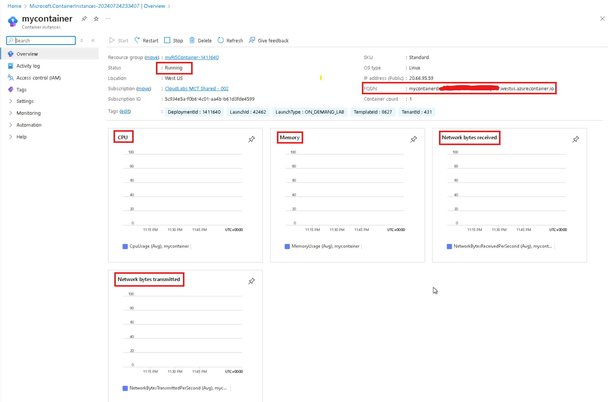
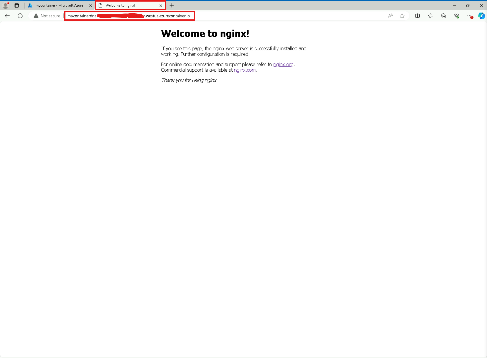

## Lab overview

Azure Container Instances enables exposing your container groups directly to the internet with an IP address and a fully qualified domain name (FQDN). When you create a container instance, you can specify a custom DNS name label so your application is reachable. Azure Container Instances offers the fastest and simplest way to run a container in Azure, without having to manage any virtual machines and without having to adopt a higher-level service.

In this walkthrough, we create, configure, and deploy a Docker container by using Azure Container Instances (ACI) in the Azure Portal. The container is an Nginx Web Server that displays Nginx welcome page.

## Lab objectives

In this lab, you will complete the following tasks:

+ Task 1: Create Azure Container Instances (ACI) and deploy a web server on it
+ Task 2: Verify deployment of the container instance

Estimated timing: 15 minutes

## Architecture diagram

 

## Task 1: Create Azure Container Instances (ACI) and deploy a web server (Nginx) on it

In this task, we will create a new container instance and deploy a web server (Nginx) on it. 

1. On the Azure Portal page, in the **Search resources, services and docs (G+/)** box at the top of the portal, enter **Container instances (1)**, and then select **Container instances (2)** under services.

   
   
1. On the **Container instances** blade, click **+ Create**. 

1. On the **Basics** tab, provide the following basic details for creating a new container instance then click **Next : Networking >** .

	| Setting | Value |
	|----|----|
	| Subscription | **Choose your subscription** |
	| Resource group | **myRGContainer-<inject key="DeploymentID" enableCopy="false" />** |
	| Container name| **mycontainer**|
	| Region | **<inject key="Region" enableCopy="false"/>** |
	| Image source| **Quickstart images**|
	| Image| **mcr.microsoft.com/oss/nginx/nginx:1.9.15-alpine (Linux)**|
	| Size| ***Leave at the default***|

 

  
  
  
2. On the **Networking** tab, specify the following and leave all other settings at their default values, then click **Next : Monitoring >** 

    | Setting| Value|
    |--|--|
    | DNS name label| **mycontainerdns<inject key="DeploymentID" enableCopy="false" /> (1)** |
    |||

    

1. De-select the checkbox beside the option **Enable container instance logs (1)**, then click **Review + create (2)**.

   
   
	>**Note**: Your container will be publicly reachable at dns-name-label.region.azurecontainer.io. If you receive a **DNS name label not available** error message following the deployment.

1. Click **Create** to create the container instance. 

1. Monitor the deployment page and the **Notifications** page.

1. While you wait you may be interested in viewing the [sample code behind this simple application](https://github.com/Azure-Samples/aci-helloworld). Browse the \app folder. 

## Task 2: Verify deployment of the container instance

In this task, we verify that the container instance is running by ensuring that the welcome page displays.

1. After the deployment is complete, click the **Go to resource** button.

   

1. On the **Overview** blade of **mycontainer**, ensure your container **Status** is **Running**.

1. Locate and copy the **Fully Qualified Domain Name (FQDN)**.

   

1. Paste the container's FQDN into the new browser tab and press **Enter**. The Welcome page should display.

   >**Note**: It might take 3 - 5 minutes to load the page.
 
   
	
   >**Note**: You could also use the container IP address in your browser.

<validation step="f87beab3-3bb6-467e-839f-c821f172a4b8" />
 
> **Congratulations** on completing the task! 

### Overview of Checking Deployment Stats:

After deploying your web server, you can monitor its deployment stats through the Azure portal:

1.	Navigate to the created Azure container instance (ACI)
2.	From the Overview tab, view metrics such as CPU, memory usage, and network statistics.
3.	You can check the status of the Azure Container instance,  if it is Stopped/Running.
4.	Manage the instance by starting or stopping it as needed

## Review
In this lab, you have completed:
- Created a container instance
- Verified deployment of the container instance

## Reference links

- https://learn.microsoft.com/en-us/azure/container-instances/container-instances-overview

- https://learn.microsoft.com/en-us/azure/container-instances/container-instances-quickstart-portal
  
## You have successfully completed this lab.

To confirm your completion and receive credit for this lab, go to the **Lab Validation** tab in the navigation bar at the top of this guide and click the **Validate** button for the task.
