## 3 Lab Tasks

### Task 1: Becoming a Certificate Authority (CA)

A Certificate Authority (CA) is a trusted entity that issues digital certificates. The digital certificate certifies the ownership of a public key by the named subject of the certificate. A number of commercial CAs
are treated as root CAs; VeriSign is the largest CA at the time of writing. Users who want to get digital
certificates issued by the commercial CAs need to pay those CAs.
In this lab, we need to create digital certificates, but we are not going to pay any commercial CA. We
will become a root CA ourselves, and then use this CA to issue certificate for others (e.g., servers). In this
task, we will make ourselves a root CA, and generate a certificate for this CA. Unlike other certificates,
which are usually signed by another CA, the root CA’s certificates are self-signed. Root CA’s certificates are
usually pre-loaded into most operating systems, web browsers, and other software that rely on PKI. Root
CA’s certificates are unconditionally trusted.

#### The Configuration File `openssl.cnf`.
In order to use `OpenSSL` to create certificates, you have to
have a configuration file. The configuration file usually has an extension `.cnf`. It is used by three `OpenSSL`
commands: `ca`, `req`, and `x509`. The manual page of `openssl.cnf` can be found from online resources.
By default, OpenSSL use the configuration file from `/usr/lib/ssl/openssl.cnf`. To view the location of the `openssl.cnf` file:

```
cd /usr/lib/ssl
ls
```

Since we need to make changes to this file, we will copy it into our current directory. Later, we will instruct `OpenSSL` to use this
copy instead of the default `openssl.cnf`.

- Copy the default OpenSSL configuration file using the following command:
```
cp /usr/lib/ssl/openssl.cnf ./myCA_openssl.cnf
```

The `[CA_default]` section of the configuration file shows the default settings that we need to prepare.
Open the `myCA_openssl.cnf` file using your editor of choice (e.g., `nano`, `vim`).

First, uncomment the `unique_subject` line in `myCA_openssl.cnf` file
(by removing the hash sign (#) in front of the `unique_subject` line in the `[CA_default]` settings) to allow
creation of certifications with the same subject, because it is very likely that we will do that in the lab.
Then, change the `dir` line to `./` instead of `./demoCA`.

##### Listing 1: Default CA Settings

```
[ CA_default ]
dir = ./demoCA # Where everything is kept
certs = $dir/certs # Where the issued certs are kept
crl_dir = $dir/crl # Where the issued crl are kept
database = $dir/index.txt # database index file.
# unique_subject = no # Set to ’no’ to allow creation of
                      # several certs with same subject.
new_certs_dir = $dir/newcerts # default place for new certs.
serial = $dir/serial # The current serial number
```

We need to create several sub-directories and files. Save and exit the `myCA_openssl.cnf` file and return to the `/usr/lib/ssl` directory.
Create the `crl` and `newcerts` directories. For the `index.txt` file, simply create an empty file named `index.txt`.
For the `serial` file, create the file and put a single number in string format (e.g. 1000) in the file.

Now that you have set up the configuration file `myCA_openssl.cnf`, you can create and issue certificates.

#### Certificate Authority (CA)
As we described before, we need to generate a self-signed certificate for our
CA. This means that this CA is totally trusted, and its certificate will serve as the root certificate. You can
run the following command to generate the self-signed certificate for the CA:

```
openssl req -x509 -newkey rsa:4096 -sha256 -days 3650 -keyout ca.key -out ca.crt
```

You will be prompted for a password. **Do not lose this password**, because you will have to type the
passphrase each time you want to use this CA to sign certificates for others. You will also be asked to fill in
the subject information, such as the Country Name, Common Name, etc.

The output of the command are stored in two files: `ca.key` and `ca.crt`.
The file `ca.key` contains the CA’s private key, while `ca.crt` contains the public-key certificate.
Running `ls` will show you these files in your directory.

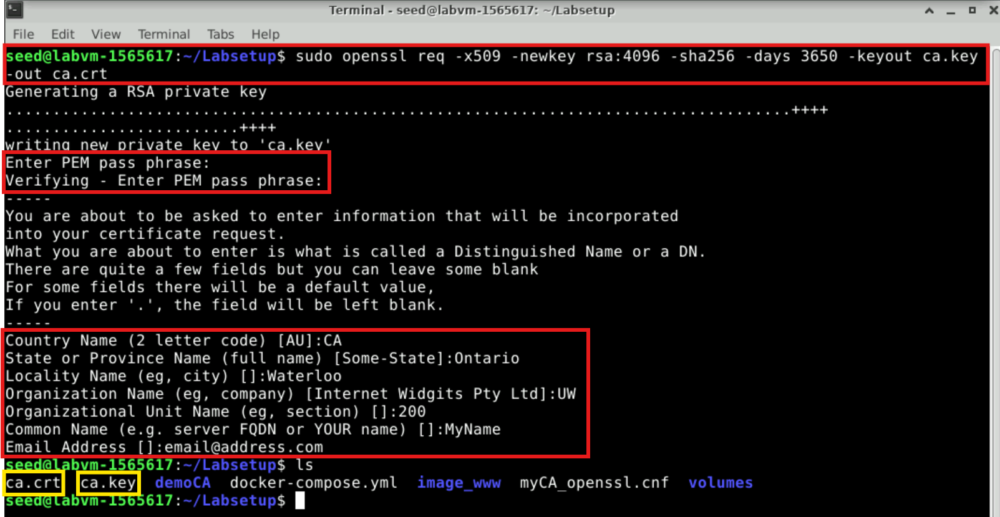

You can also specify the subject information and password in the command line, so you will not be
prompted for any additional information. In the following command, we use  `-subj` to set the subject
information and we use `-passout pass:dees` to set the password to `dees`.

```
openssl req -x509 -newkey rsa:4096 -sha256 -days 3650 \
-keyout ca.key -out ca.crt \
-subj "/CN=www.modelCA.com/O=Model CA LTD./C=US" \
-passout pass:dees
```

We can use the following commands to look at the decoded content of the X509 certificate and the
RSA key (`-text` means decoding the content into plain text; `-noout` means not printing out the encoded
version):

```
openssl x509 -in ca.crt -text -noout
openssl rsa -in ca.key -text -noout
```

Please run the above commands. From the output, please identify the following:

- Which part of the certificate indicates this is a CA’s certificate?

  After running the command `openssl x509 -in ca.crt -text -noout`, we can examine the certificate content. 

  - In the `Basic Constraints` section in the certificate output, it should contain:
  `X509v3 Basic Constraints:
        CA:TRUE`
    This indicates that the certificate is issued for a Certificate Authority (CA) (`CA:TRUE`). 

  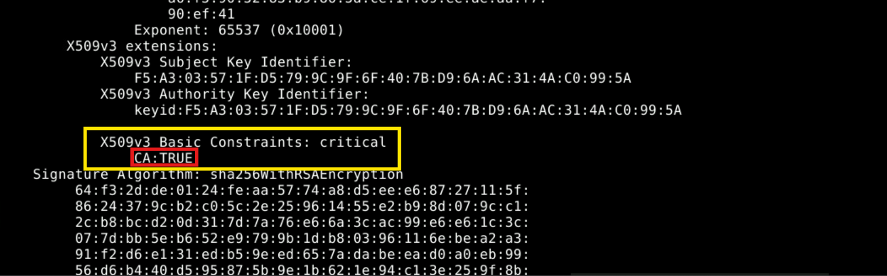
  
- Which part of the certificate indicates this is a self-signed certificate?
  - Looking at the `Issuer` and `Subject` fields, if they are identical, it means the certificate is self-signed.

  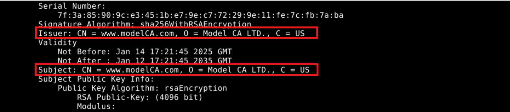
  
- In the RSA algorithm, we have a public exponent (e), a private exponent (d), a modulus (n), and two secret
    numbers (p) and (q) , such that n = p*q. Please identify the values for these elements in your key file.

  After running the command `openssl rsa -in ca.key -text -noout`, we can examine the private key content and look at the following elements:
  
    - Public Exponent (e): This is usually a small value like `65537`. Look for the line starting with `publicExponent` in the key output
      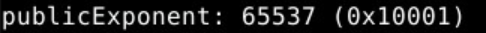
      
    - Private Exponent (d): This is the value of the private key's exponent, found in the line labeled `privateExponent`.
      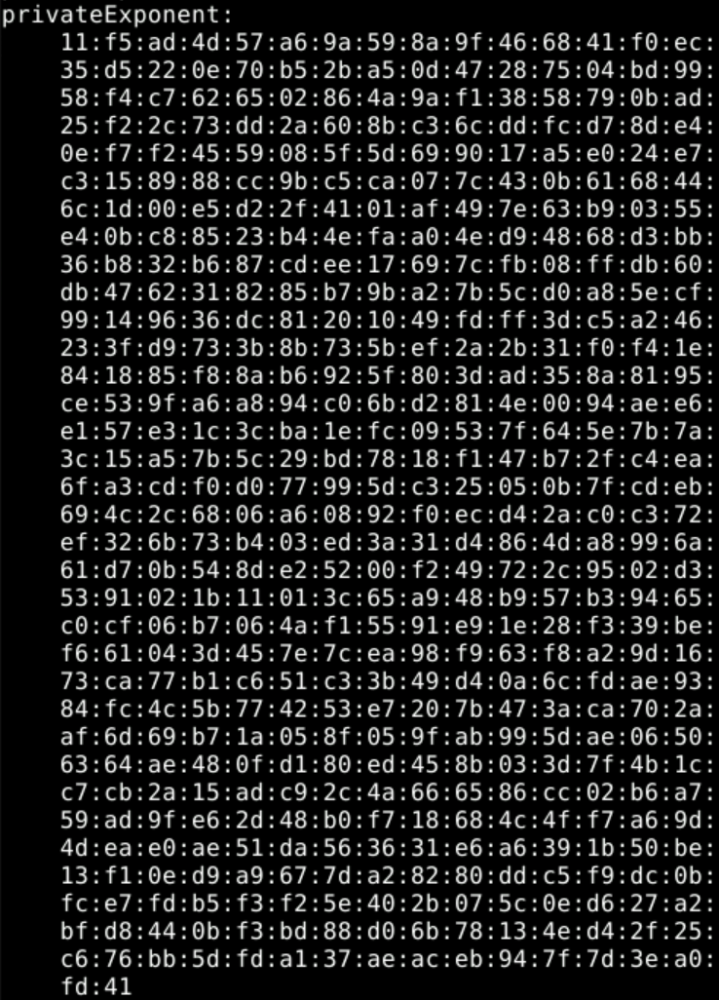
      
    - Modulus (n): This is the large number calculated as `n = p * q`, found in the line labeled `modulus`.
      
      
    - Prime Numbers (p and q): These are the two large prime numbers used to calculate `n`. Look for the lines labeled `prime1` and `prime2`.
      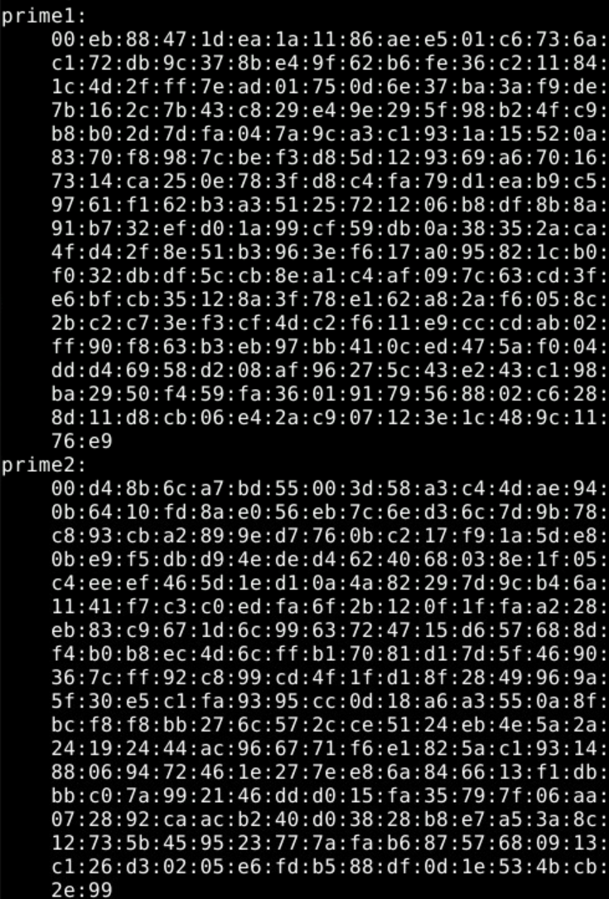
      

### Task 2: Generating a Certificate Request for Your Web Server

A company called `bank32.com` wants to get a public-key certificate from our CA.
First it needs to generate a Certificate Signing Request (CSR), which basically
includes the company’s public key and identity information. The CSR will be sent to the CA, who will
verify the identity information in the request, and then generate a certificate.
The command to generate a CSR is quite similar to the one we used in creating the self-signed certificate for the CA.
The only difference is the `-x509` option. Without it, the command generates a request; with it,
the command generates a self-signed certificate. The following command generate a CSR for `www.bank32.com`:

```
openssl req -newkey rsa:2048 -sha256 -keyout server.key -out server.csr -subj "/CN=www.bank32.com/O=Bank32 Inc./C=US" -passout pass:dees
```

The command will generate a pair of public/private keys, and then create a certificate signing request
from the public key. We can use the following commands to look at the decoded content of the CSR and
private key files:

```
openssl req -in server.csr -text -noout
openssl rsa -in server.key -text -noout
```

#### Adding Alternative names
Many websites have different URLs. For example, `www.example.com`, `example.com`, `example.net`, and `example.org` are all pointing to the same web server. Due to the hostname matching policy enforced by browsers, the common name in a certificate must match with the
server’s hostname, or browsers will refuse to communicate with the server.
To allow a certificate to have multiple names, the X.509 specification defines extensions to be attached
to a certificate. This extension is called Subject Alternative Name (SAN). Using the SAN extension, it’s
possible to specify several hostnames in the `subjectAltName` field of a certificate.
To generate a certificate signing request with such a field, we can put all the necessary information
in a configuration file or at the command line. We will use the command-line approach in this task. 
It should be noted that the `subjectAltName` extension field must also include the one from the common name field;
otherwise, the common name will not be accepted as a valid name.

```
openssl req -newkey rsa:2048 -sha256 -keyout server.key -out server.csr -subj "/CN=www.bank32.com/O=Bank32 Inc./C=US" -addext "subjectAltName = DNS:www.bank32.com, DNS:www.bank32A.com, DNS:www.bank32B.com" -passout pass:dees
```

### Task 3: Generating a Certificate for your server

The CSR file needs to have the CA’s signature to form a certificate. In the real world, the CSR files are
usually sent to a trusted CA for their signature. In this lab, we will use our own trusted CA to generate
certificates. The following command turns the certificate signing request `server.csr` into an X509 certificate `server.crt`, using the CA’s `ca.crt` and `ca.key`:

```
openssl ca -config myCA_openssl.cnf -policy policy_anything -md sha256 -days 3650 -in server.csr -out server.crt -batch -cert ca.crt -keyfile ca.key
```

In the above command, `myCA_openssl.cnf` is the configuration file we copied from `/usr/lib/ssl/openssl.cnf` (we also made changes to this file in Task 1).
We use the `policy_anything` policy defined in the configuration file. This is not the default policy; the default policy has more restriction,
requiring some of the subject information in the request to match those in the CA’s certificate. The policy
used in the command, as indicated by its name, does not enforce any matching rule.

#### Copy the extension field
For security reasons, the default setting in `openssl.cnf` does not allow the `openssl ca` command to copy the extension field from the request to the final certificate. To enable
that, we can go to our copy of the configuration file (`myCA_openssl.cnf`) and uncomment the following line:

```
# Extension copying option: use with caution.
copy_extensions = copy
```

After signing the certificate, please use the following command to print out the decoded content of the
certificate, and check whether the alternative names are included.

```
openssl x509 -in server.crt -text -noout
```

### Task 4: Deploying Certificate in an Apache-Based HTTPS Website

In this task, we will see how public-key certificates are used by websites to secure web browsing. We will
set up an HTTPS website based Apache. The Apache server, which is already installed in our container,
supports the HTTPS protocol. To create an HTTPS website, we just need to configure the Apache server,
so it knows where to get the private key and certificates. Inside our container, we have already set up an
HTTPS site for `bank32.com`. An Apache server can simultaneously host multiple websites. It needs to know the directory where
a website’s files are stored. This is done via its `VirtualHost` file, located in the `/etc/apache2/sites-available` directory.
In our container, we have a file called `bank32_apache_ssl.conf`, which contains the following entry:

```
<VirtualHost *:443>
DocumentRoot /var/www/bank
ServerName [http://www.bank32.com](http://www.bank32.com)
ServerAlias [http://www.bank32A.com](http://www.bank32A.com)
ServerAlias [http://www.bank32B.com](http://www.bank32B.com)
ServerAlias [http://www.bank32W.com](http://www.bank32W.com)
DirectoryIndex index.html
SSLEngine On
SSLCertificateFile /certs/bank32.crt
SSLCertificateKeyFile /certs/bank32.key
</VirtualHost>
```

The above example sets up the HTTPS site `https://www.bank32.com` (port `443` is the default
HTTPS port). The `ServerName` entry specifies the name of the website, while the `DocumentRoot`
entry specifies where the files for the website are stored. Using the `ServerAlias` entries, we allow the
website to have different names.
We also need to tell Apache where the server certificate (Line 8) and private key (Line 9) are stored. In
the `Dockerfile`, we have already included the commands to copy the certificate and key to the `/certs` folder of the container.
In order to make the website work, we need to enable Apache’s `ssl` module and then enable this site.
They can be done using the following commands, which are already executed when the container is built.

```
a2enmod ssl // Enable the SSL module
a2ensite bank32_apache_ssl // Enable the sites described in this file
```

#### Starting the Apache server
The Apache server is not automatically started in the container, because of
the need to type the password to unlock the private key. Let’s go to the container and run the following
command to start the server:

```
# Start the server
service apache2 start
```

There are other useful server commands that you should know, though they aren't needed now:

```
# Stop the server
service apache2 stop

# Restart a server
service apache2 restart
```

When Apache starts, it needs to load the private key for each HTTPS site. Our private key is encrypted,
so Apache will ask us to type the password for decryption. Inside the container, the password used for `bank32` is `dees`.
Once everything is set up properly, we can browse the web site, and all the traffic
between the browser and the server will be encrypted.

#### Shared folder between the VM and container
Note that sometimes when working in a VM, we need to copy files from the VM to the
container. To avoid repeatedly recreating containers, we have created a shared folder between the VM and
container, `volumes`, which is inside the `Labsetup` folder on the VM.
When you use the `docker-compose.yml` file inside the `Labsetup` folder to create containers, as you've done in this lab,
the `volumes` sub-folder will be mounted to the container. Anything you put inside this folder will be accessible from
inside of the running container.

#### Browsing the website. 
Now, open Firefox, and point the browser to your web server (note: you need to put `https` at the
beginning of your URL, instead of using `http`). Most likely, you will see a warning or error message as shown in the figure below.
This is because the browser does not recognize your self-signed certificate as a trusted certificate because it is not issued by a
well-known Certificate Authority (CA). Browsers only trust certificates from established, pre-configured CAs.

  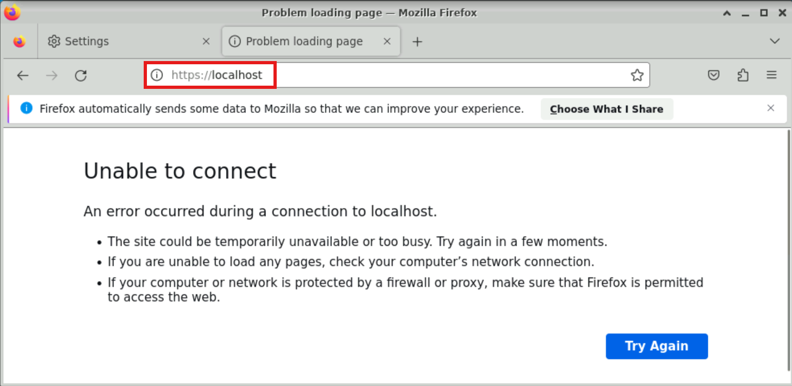

To resolve the issue, you need to manually add your self-signed certificate as a trusted authority in the browser.
You have to ensure that you have the `ca.crt` file generated earlier. Then, in Firefox, type `about:preferences#privacy`
in the address bar and scroll down to the `Certificates` section and click `View Certificates` as shown in the figure below.
```
about:preferences#privacy
```
 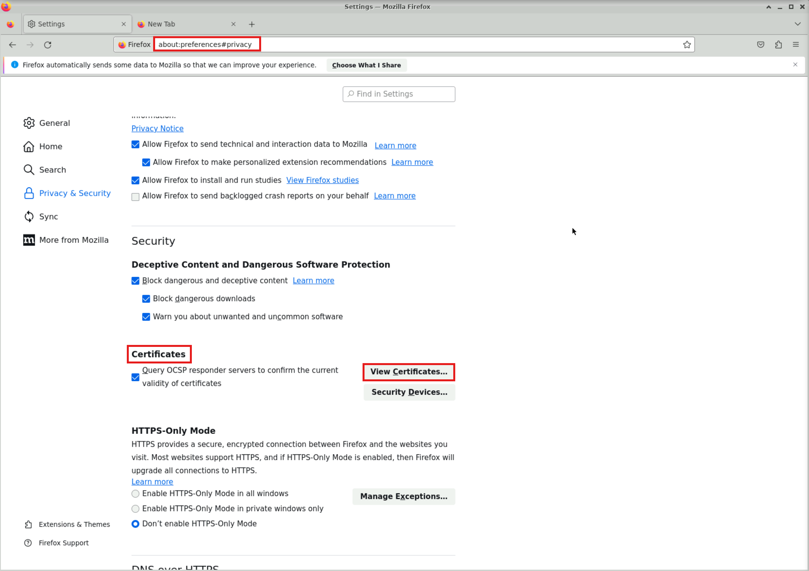

In the `Authorities` tab, you will see a list of certificates that are already accepted by Firefox. From here, we can import our own certificates. 

 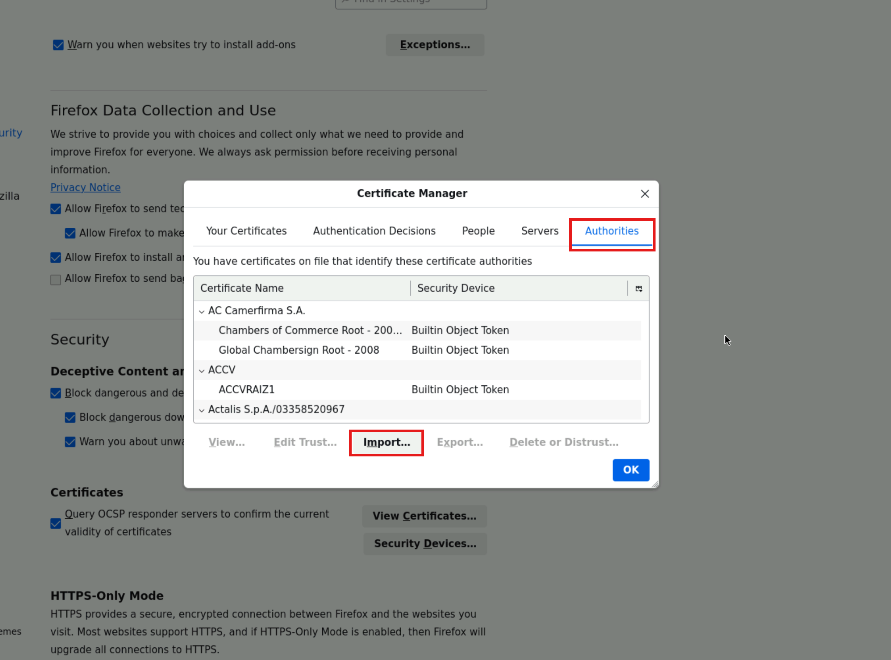

Navigate to the `\Labsetup\image_www` folder in your VM and select the `modelCA.crt` certificate.
After choosing the certificate file, please select the following option: “Trust this CA to identify web sites”.

  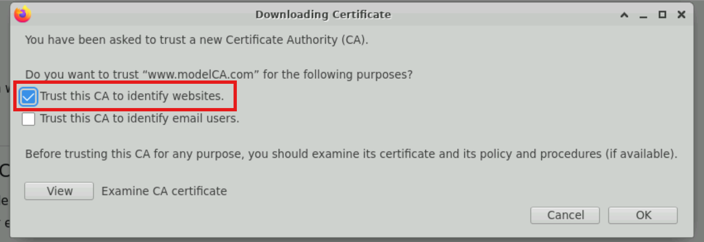

Scrolling through the list, you will see that our `Model CA LTD.` certificate is now in Firefox’s list of accepted certificates.

To confirm that your certificate is working as intended, in your browser you can navigate to `https://www.bank32.com` and confirm that the site loads without a warning.

#### You have successfully completed the task
To confirm your completion and receive credit for the tasks that you have completed so far, go to the **Lab Validation** tab in the navigation bar at the top of this guide and click the **Validate** button for **Creating a Root Certificate Authority (CA)**, **Generating a Certificate**, and **Deploying Certificate**. If your any of your task validations failed, read the validation information for more details, and try the steps in the task again.

### Task 5: Launching a Man-In-The-Middle Attack

In this task, we will show how PKI can defeat Man-In-The-Middle (MITM) attacks. Figure 1 depicts how
MITM attacks work. Assume Alice wants to visit `example.com` via the HTTPS protocol. She needs to get
the public key from the `example.com` server; Alice will generate a secret, and encrypt the secret using the
server’s public key, and send it to the server. If an attacker can intercept the communication between Alice
and the server, the attacker can replace the server’s public key with its own public key. Therefore, Alice’s
secret is actually encrypted with the attacker’s public key, so the attacker will be able to read the secret. The
attacker can forward the secret to the server using the server’s public key. The secret is used to encrypt the
communication between Alice and server, so the attacker can decrypt the encrypted communication.
The goal of this task is to help students understand how PKI can defeat such MITM attacks. In the task,
we will emulate an MITM attack, and see how exactly PKI can defeat it. We will select a target website
first. In this document, we use `www.example.com` as the target website.


Figure 1: A Man-In-The-Middle (MITM) attack

#### Step 1: Setting up the malicious website. 
In Task 4, we have already set up an HTTPS website. We
will use the same Apache server to impersonate `www.example.com`.
To achieve that, follow the instruction in Task 4 to add a `VirtualHost` entry to Apache’s SSL
configuration file: the `ServerName` should be `www.example.com`, but the rest of the configuration can
be the same as that used in Task 4. Obviously, in the real world, you won’t be able to get a valid certificate
for `www.example.com`, so we will use the same certificate that we used for our own server.

Our goal is the following: when a user tries to visit `www.example.com`, we are going to get the user
to land in our server, which hosts a fake website for `www.example.com`. If this were a social network
website, the fake site could display a login page similar to the one in the target website. If users cannot
tell the difference, they may type their account credentials in the fake webpage, essentially disclosing the
credentials to the attacker.

#### Step 2: Becoming the man in the middle.
There are several ways to get the user’s HTTPS request to land
in our web server. One way is to attack the routing, so the user’s HTTPS request is routed to our web server.
Another way is to attack DNS, so when the victim’s machine tries to find out the IP address of the target web
server, it gets the IP address of our web server. In this task, we simulate the attack-DNS approach. Instead of
launching an actual DNS cache poisoning attack, we simply modify the victim’s machine’s `/etc/hosts`
file to emulate the result of a DNS cache positing attack by mapping the hostname `www.example.com` to
our malicious web server. We do this by adding the following line at the bottom of the file:

```
10.9.0.80 [http://www.example.com](http://www.example.com)
```

#### Step 3: Browse the target website. 
With everything set up, now visit the target real website, and see what
your browser would say. As shown in the screen shots below, the browser will display a warning when accessing https://www.example.com.

Figure 2 shows the Apache2 Ubuntu Default Page displayed when accessing http://www.example.com. This indicates that the browser request is being directed to our server, confirming the DNS redirection is working.


Figure 2: Apache2 Default Page showing successful DNS redirection to the attacker’s server for http://www.example.com.

Figure 3 shows the browser displaying a "Warning: Potential Security Risk Ahead" message when accessing https://www.example.com. The warning occurs because the certificate presented by our server isn't valid for www.example.com. This mismatch alerts the browser and helps block potential MITM attacks.

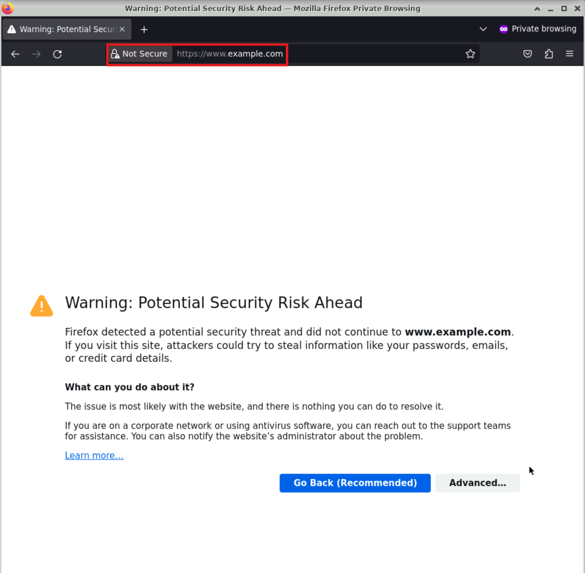

Figure 3: Security warning in the browser when accessing https://www.example.com

### You have successfully completed the task

To confirm your completion and receive credit for this task, go to the **Lab Validation** tab in the navigation bar at the top of this guide and click the **Validate** button for the **Man-In-The-Middle Attack** task. If your task validation failed, read the validation information for more details, and try the steps in the task again.

### You have successfully completed the lab
To confirm your completion and receive credit for this lab, go to the **Lab Validation** tab in the navigation bar at the top of this guide and confirm that all four tasks have validated.
