## 3. Task 1: Experimenting with Stateless Firewall Rules

Linux already has a built-in firewall called `iptables`. Technically, the kernel part implementation of the firewall is called `Xtables`, while `iptables` is a user-space program to configure the firewall. However,`iptables` is often used to refer to both the kernel-part implementation
and the user-space program.

### 3.1 Background of `iptables`

In this task, we will use `iptables` to set up a firewall. The` iptables` firewall is designed not only to filter packets, but also to make changes to packets. To help manage these firewall rules for different purposes, `iptables` organizes all rules using a hierarchical structure: table, chain, and rules. There are several tables, each specifying the main purpose of the rules as shown in Table 1 below. For example, rules for packet filtering should be placed in the `filter` table, while rules for making changes to packets should be placed in the `nat` or `mangle` tables.

&emsp; &emsp; &emsp; &emsp; &emsp; &emsp;  &emsp; &emsp; Table 1: `iptables` Tables and Chains


Each table contains several chains, each of which corresponds to a `netfilter` hook. Basically, each chain indicates where its rules are enforced. For example, rules on the `FORWARD` chain are enforced at the `NF_INET_FORWARD` hook, and rules on the `INPUT` chain are enforced at the `NF_INET_LOCALIN` hook.

Each chain contains a set of firewall rules that will be enforced. When we set up firewalls, we add rules to these chains. For example, if we would like to block all incoming `telnet` traffic, we would add a rule to the `INPUT` chain of the `filter` table. If we would like to redirect all incoming `telnet` traffic to a different port on a different host, basically doing port forwarding, we can add a rule to the `INPUT` chain of the `mangle` table, as we need to make changes to packets.

### 3.2 Using `iptables`

To add rules to the chains in each table, we use the `iptables` command, which is a quite powerful command. Students can find the manual of `iptables` by typing `man iptables` or easily find many tutorials from online. What makes `iptables` complicated is the many command-line arguments that we need to provide when using the command. However, if we understand the structure of these command-line arguments, we will find out that the command is not that complicated.

In a typical `iptables` command, we add a rule to or remove a rule from one of the chains in one of the tables, so we need to specify a table name (the default is `filter`), a chain name, and an operation on the chain. After that, we specify the rule, which is basically a pattern that will be matched with each of the packets passing through. If there is a match, an action will be performed on this packet. The general
structure of the command is depicted in the following:

```
iptables -t <table> -<operation> <chain>  <rule>  -j <target>
         ----------  -------------------- ------- -----------
           Table       Chain               Rule     Action
```
&emsp; The rule is the most complicated part of the iptables command. We will provide additional information later when we use specific rules. In the following, we list some commonly used commands:
```
// List all the rules in a table (without line number)
iptables -t nat -L -n

// List all the rules in a table (with line number)
iptables -t filter -L -n --line-numbers

// Delete rule No. 2 in the INPUT chain of the filter table
iptables -t filter -D INPUT 2

// Drop all the incoming packets that satisfy the <rule>
iptables -t filter -A INPUT <rule> -j DROP
```

The command `iptables -t filter -L -n --line-numbers` shows all the rules in a table (with line number):
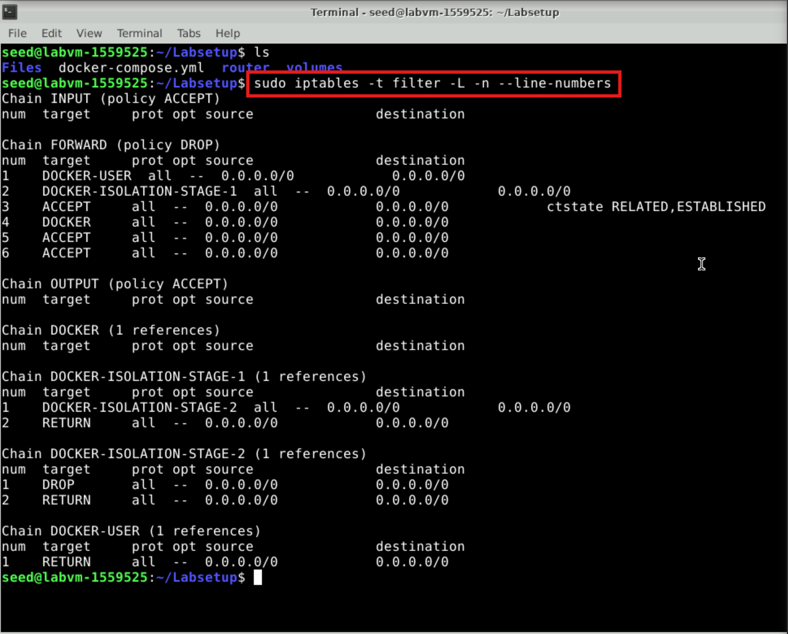

**Note.** Docker relies on `iptables` to manage the networks it creates, so it adds many rules to the `nat` table. When we manipulate `iptables` rules, we should be careful not to remove Docker rules. For example, it will be quite dangerous to run the "`iptables -t nat -F`" command, because it removes all the rules in the `nat` table, including many of the Docker rules. That will cause trouble to Docker containers. Doing this for the `filter` table is fine, because Docker does not touch this table.

### 3.3 Task 1.A: Protecting the Router

In this task, we will set up rules to prevent outside machines from accessing the router machine, except `ping`. This set of `iptables` rules focuses on protecting the router by controlling ICMP traffic and setting default DROP policies for both the INPUT and OUTPUT chains. Please execute the following `iptables` commands **on the router container**. 

```
iptables -A INPUT  -p icmp --icmp-type echo-request -j ACCEPT
iptables -A OUTPUT -p icmp --icmp-type echo-reply   -j ACCEPT
#Set default rule for OUTPUT
iptables -P OUTPUT DROP
#Set default rule for INPUT
iptables -P INPUT  DROP
```

- The first rule, `iptables -A INPUT -p icmp --icmp-type echo-request -j ACCEPT`, allows incoming ICMP echo-request packets, which are commonly used for ping requests. This ensures that the router will respond to pings, enabling basic network diagnostics.
- The second rule, `iptables -A OUTPUT -p icmp --icmp-type echo-reply -j ACCEPT`, permits outgoing ICMP echo-reply packets, which are the responses sent when the router replies to an incoming ping. These two rules allow the router to participate in ping operations, both receiving and sending replies.
- The third rule, `iptables -P OUTPUT DROP`, sets the default policy for the OUTPUT chain to drop, meaning that unless explicitly allowed by another rule, the router will not send any outbound traffic.
- Similarly, the fourth rule, `iptables -P INPUT DROP`, sets the default policy for the INPUT chain to drop, blocking all incoming traffic by default unless it matches a specific rule. These default drop policies are part of a restrictive security setup to prevent unauthorized communication, allowing only explicitly permitted traffic like ping requests and replies.

Now, try to access the router from `10.9.0.5`.

(1) Can you ping the router? Recall that the router is `10.9.0.11`. 

(2) Can you telnet into the router? (a telnet server is running on all the containers; an account called `seed` was created on them with a password `dees`)

After running `ping` and `telnet` commands, you can see the following outputs:

**ping**

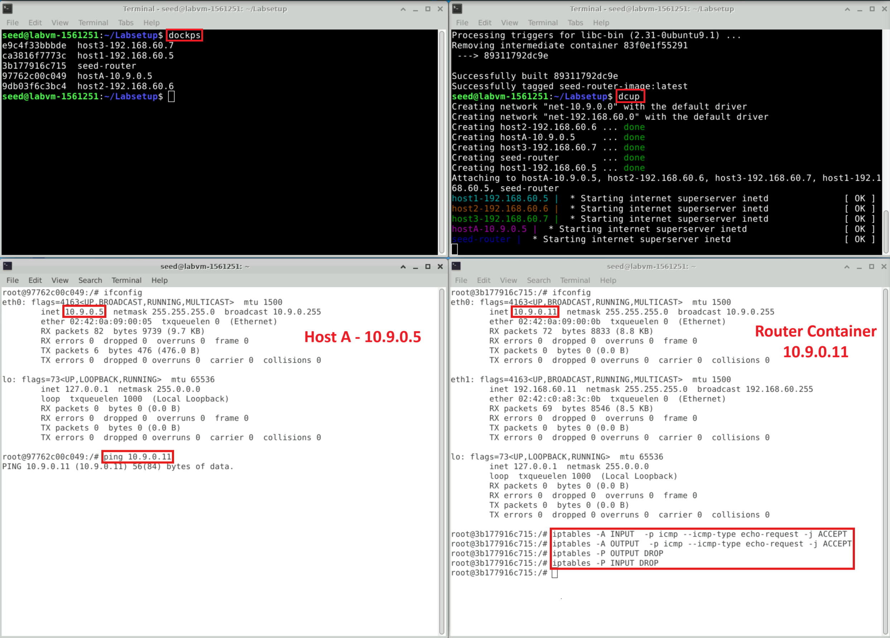

**telnet**

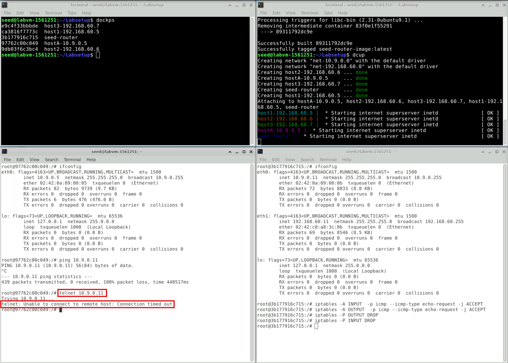

**Cleanup.** Before moving on to the next task, in the router container, please restore the `filter` table to its original state by running the following commands:
```
iptables -F
iptables -P OUTPUT ACCEPT
iptables -P INPUT ACCEPT
```
Another way to restore the states of all the tables is to restart the container. You can do it using the following command (you need to find the container’s ID first):
```
$ docker restart <Container ID>
```
### 3.4 Task 1.B: Protecting the Internal Network

In this task, we will set up firewall rules on the router to protect the internal network `192.168.60.0/24`. We need to use the `FORWARD` chain for this purpose.

The directions of packets in the `INPUT` and `OUTPUT` chains are clear: packets are either coming into (for `INPUT`) or going out (for `OUTPUT`). This is not true for the `FORWARD` chain, because it is bi-directional: packets going into the internal network or going out to the external network all go through this chain. To specify the direction, we can add the interface options using `-i xyz` (coming in from the `xyz` interface) and/or `-o xyz` (going out from the `xyz` interface). The interfaces for the internal and external networks are different. You can find out the interface names via the `ip addr` command.

In this task, we want to implement a firewall to protect the internal network. More specifically, we need to enforce the following restrictions on the ICMP traffic:

1. Outside hosts cannot ping internal hosts.
2. Outside hosts can ping the router.
3. Internal hosts can ping outside hosts.
4. All other packets between the internal and external networks should be blocked.

You will need to use the `-p icmp` options to specify the match options related to the ICMP protocol. You can run `iptables -p icmp -h` to find out all the ICMP match options. The following example drops the ICMP echo request.
```
iptables -A FORWARD -p icmp --icmp-type echo-request -j DROP
```
To configure the required rules for this task, you need to run the following commands on the router:

**Rule 1:** Block ICMP echo requests from external hosts to internal hosts:
```
iptables -A FORWARD -p icmp --icmp-type echo-request -i eth0 -o eth1 -j DROP
```

**Rule 2:** Allow external hosts to ping the router's external interface:
```
iptables -A INPUT -p icmp --icmp-type echo-request -i eth0 -j ACCEPT
iptables -A OUTPUT -p icmp --icmp-type echo-reply -o eth0 -j ACCEPT
```

**Rule 3:** Allow internal hosts to ping external hosts:
```
iptables -A FORWARD -p icmp --icmp-type echo-request -i eth1 -o eth0 -j ACCEPT
iptables -A FORWARD -p icmp --icmp-type echo-reply -i eth0 -o eth1 -j ACCEPT
```

**Rule 4:** Block all other traffic between internal and external networks:
```
iptables -A FORWARD -i eth0 -o eth1 -j DROP
iptables -A FORWARD -i eth1 -o eth0 -j DROP
```

**Testing.**
From an external host (e.g., `10.9.0.1` or `10.9.0.5`):
   - Ping the router's external IP (`10.9.0.11`):
   ```
   ping 10.9.0.11
   ```
   
   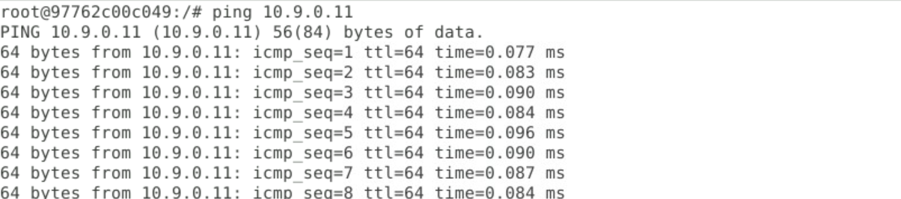

   - Ping an internal host (`192.168.60.5`):
   ```
   ping 192.168.60.5
   ```

   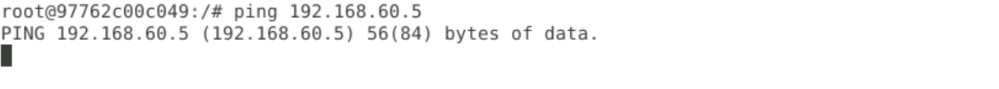

You can list your active rules on the router using the following command:
```
iptables -L -v -n
```
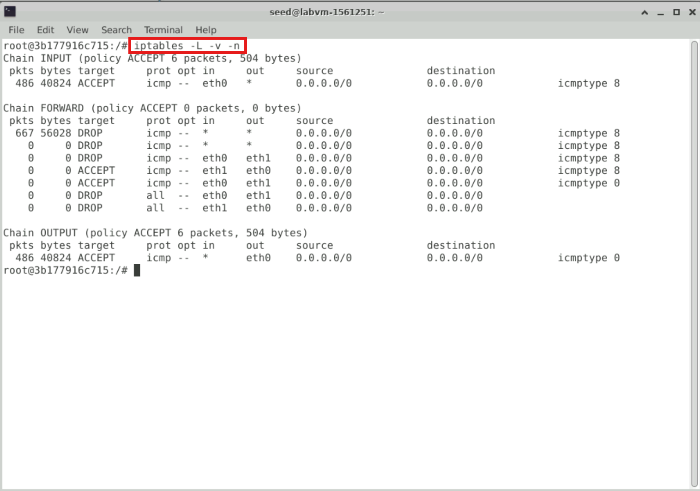

When you are done with this task, please remember to clean the table or restart the container before moving on to the next task.

Restore the `filter` table :
```
iptables -F
iptables -P OUTPUT ACCEPT
iptables -P INPUT ACCEPT
```
Restart the container:
```
$ docker restart <Container ID>
```

### 3.5 Task 1.C: Protecting Internal Servers

In this task, we want to protect the TCP servers inside the internal network ( `192.168.60.0/24`). More specifically, we would like to achieve the following objectives.

1. All the internal hosts run a telnet server (listening to port `23`). Outside hosts can only access the telnet server on `192.168.60.5`, not the other internal hosts.
2. Outside hosts cannot access other internal servers.
3. Internal hosts can access all the internal servers.
4. Internal hosts cannot access external servers.
5. In this task, the connection tracking mechanism is not allowed. It will be used in a later task.

You will need to use the `-p tcp` options to specify the match options related to the TCP protocol. You can run `iptables -p tcp -h` to find out all the TCP match options. The following example allows the TCP packets coming from the interface `eth0` if their source port is `5000`.
```
iptables -A FORWARD -i eth0 -p tcp --sport 5000 -j ACCEPT
```

To configure the required rules for this task, you need to run the following commands on the router:

**Rule 1:** Allow external access to Telnet server on 192.168.60.5
```
   iptables -A FORWARD -i eth0 -o eth1 -p tcp --dport 23 -d 192.168.60.5 -j ACCEPT
```
This command allows external hosts to connect to the Telnet server on `192.168.60.5` (port `23`) through the router.

**Rule 2:** Block external access to other internal servers
```
iptables -A FORWARD -i eth0 -o eth1 -p tcp --dport 23 -j DROP
```
This command blocks external hosts from accessing Telnet servers on any other internal host (`192.168.60.6` or `192.168.60.7`).

**Rule 3:** Block external access to all other internal servers
```
iptables -A FORWARD -i eth0 -o eth1 -p tcp -j DROP
```
This ensures that external hosts cannot access any other TCP services (apart from the allowed Telnet server) in the internal network.

**Rule 4:** Allow internal hosts to access all internal servers
```
iptables -A FORWARD -i eth1 -o eth1 -j ACCEPT
```
This allows internal hosts to communicate with each other without restrictions.

**Rule 5:** Block internal hosts from accessing external servers
```
iptables -A FORWARD -i eth1 -o eth0 -j DROP
```
This prevents internal hosts from accessing any servers in the external network.

**Testing.**
In this section, there are some examples for some outputs:

1. From an internal host (e.g., `192.168.60.6`):
   - Access Telnet on any internal server:
   ```
   telnet 192.168.60.5
   ```
   
   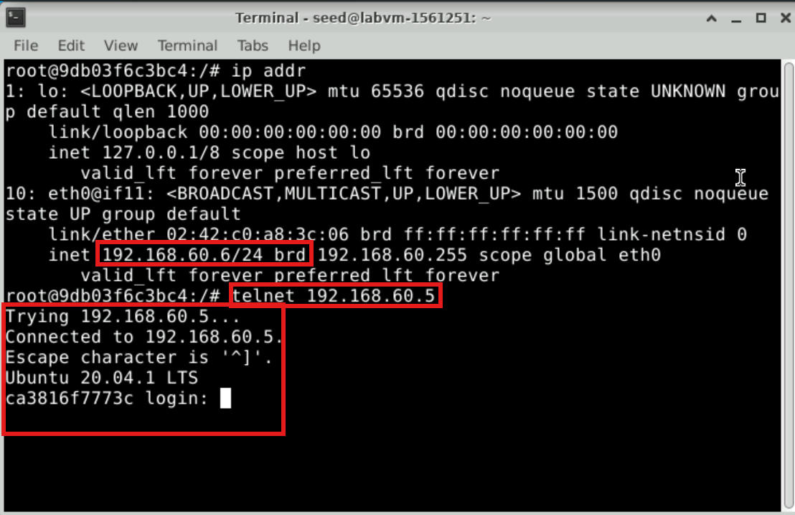
   
2. From an internal host (e.g., `192.168.60.5`):
   - Access external host Telnet server:
   ```
   telnet 10.9.0.1
   ```
   
   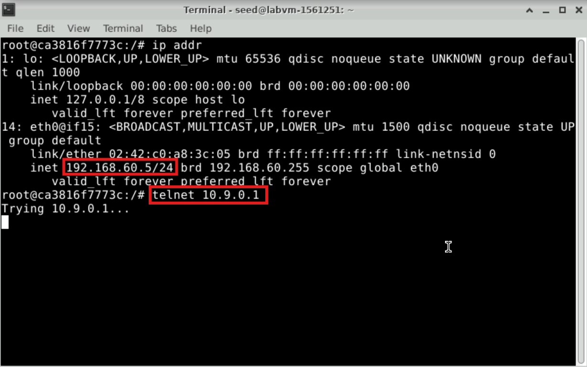
 

You can list your active rules on the router using the following command:
```
iptables -L -v -n
```
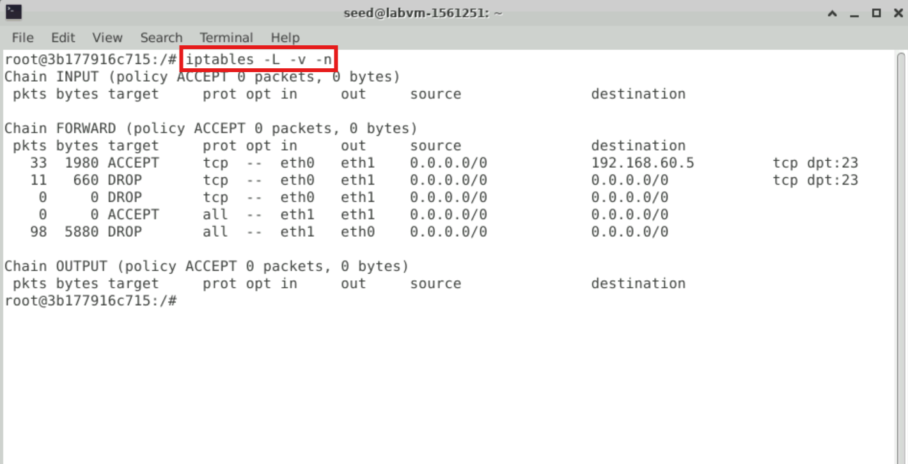


When you are done with this task, please remember to clean the table or restart the container before moving on to the next task.

Restore the `filter` table :
```
iptables -F
iptables -P OUTPUT ACCEPT
iptables -P INPUT ACCEPT
```
Restart the container:
```
$ docker restart <Container ID>
```
## 4. Task 2: Connection Tracking and Stateful Firewall

In the previous task, we have only set up stateless firewalls, which inspect each packet independently. However, packets are usually not independent; they may be part of a TCP connection, or they may be ICMP packets triggered by other packets. Treating them independently does not take into consideration the context of the packets, and can thus lead to inaccurate, unsafe, or complicated firewall rules. For example, if we would like to allow TCP packets to get into our network only if a connection was made first, we cannot achieve that easily using stateless packet filters, because when the firewall examines each individual TCP packet, it has no idea whether the packet belongs to an existing connection or not, unless the firewall maintains some state information for each connection. If it does that, it becomes a stateful firewall.

### 4.1 Task 2.A: Experiment with the Connection Tracking

To support stateful firewalls, we need to be able to track connections. This is achieved by the `conntrack` mechanism inside the kernel. In this task, we will conduct experiments related to this module, and get familiar with the connection tracking mechanism. In our experiment, we will check the connection tracking information on the router container. This can be done using the following command:
```
conntrack -L
```

The goal of the task is to use a series of experiments to help students understand the connection concept in this tracking mechanism, especially for the ICMP and UDP protocols, because unlike TCP, they do not have connections. Please conduct the following experiments. 

- **ICMP experiment**: Run the following command on the specified container and check the connection tracking information on the router. Observe the output. How long is the ICMP connection state being kept?
    ```
    // On 10.9.0.5, send out ICMP packets
    ping 192.168.60.5
    ```
   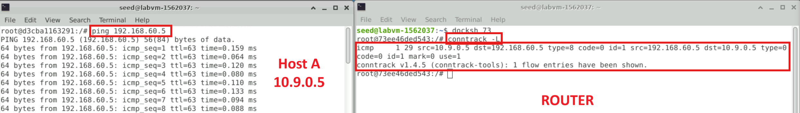

- **UDP experiment**: Run the following commands on the specified containers and check the connection tracking information on the router. Observe the output. How long is the UDP connection state being kept?
    ```
    // On 192.168.60.5, start a netcat UDP server
    nc -lu 9090

    // On 10.9.0.5, send out UDP packets
    nc -u 192.168.60.5 9090
    <type something, then hit return>
    ```

    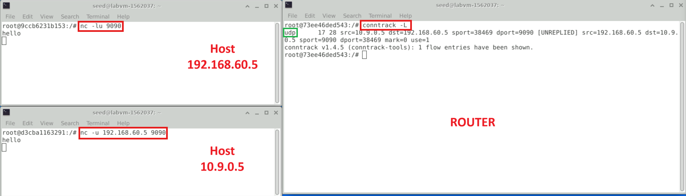

- **TCP experiment**: Run the following commands on the specified containers and check the connection tracking information on the router. Observe the output. How long is the TCP connection state being kept?
    ```
    // On 192.168.60.5, start a netcat TCP server
    nc -l 9090

    // On 10.9.0.5, send out TCP packets
    nc 192.168.60.5 9090
    <type something, then hit return>
    ```
    
   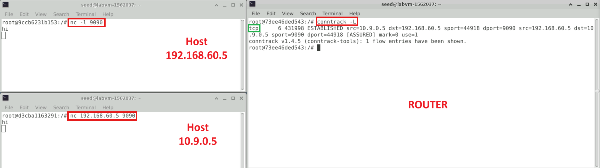
  
### 4.2 Task 2.B: Setting Up a Stateful Firewall

Now we are ready to set up firewall rules based on connections. In the following example, the `-m conntrack` option indicates that we are using the `conntrack` module, which is a very important module for `iptables`; it tracks connections, and `iptables` replies on the tracking information to build stateful firewalls. The `--ctsate ESTABLISHED,RELATED` indicates whether a packet belongs to an `ESTABLISHED` or `RELATED` connection. The rule allows TCP packets belonging to an existing connection to pass through.
```
iptables -A FORWARD -p tcp -m conntrack --ctstate ESTABLISHED,RELATED -j ACCEPT
```
The rule above does not cover the SYN packets, which do not belong to any established connection. Without it, we will not be able to create a connection in the first place. Therefore, we need to add a rule to accept incoming SYN packets:
```
iptables -A FORWARD -p tcp -i eth0 --dport 8080 --syn -m conntrack --ctstate NEW -j ACCEPT
```
Finally, we will set the default policy on FORWARD to drop everything. This way, if a packet is not accepted by the two rules above, they will be dropped.
```
iptables -P FORWARD DROP
```


## 5. Task 3: Limiting Network Traffic

In addition to blocking packets, we can also limit the number of packets that can pass through the firewall. This can be done using the `limit` module of `iptables`. In this task, we will use this module to limit how many packets from `10.9.0.5` are allowed to get into the internal network. You can use `iptables -m limit -h` to see the manual. 
```
$ iptables -m limit -h
limit match options:
--limit avg          max average match rate: default 3/hour
                     [Packets per second unless followed by
                     /sec /minute /hour /day postfixes]
--limit-burst number number to match in a burst, default 5
```
Please run the following command on the router, and then ping `192.168.60.5` from `10.9.0.5`.
```
iptables -A FORWARD -s 10.9.0.5 -m limit --limit 10/minute --limit-burst 5 -j ACCEPT
```

Now, repeat the process but add a second rule. Is that second rule needed? Why?
```
iptables -A FORWARD -s 10.9.0.5 -m limit --limit 10/minute --limit-burst 5 -j ACCEPT
iptables -A FORWARD -s 10.9.0.5 -j DROP
```

In these figures, you can see the difference with the second rule (DROP) and without it.
- This one without the DROP rule.
   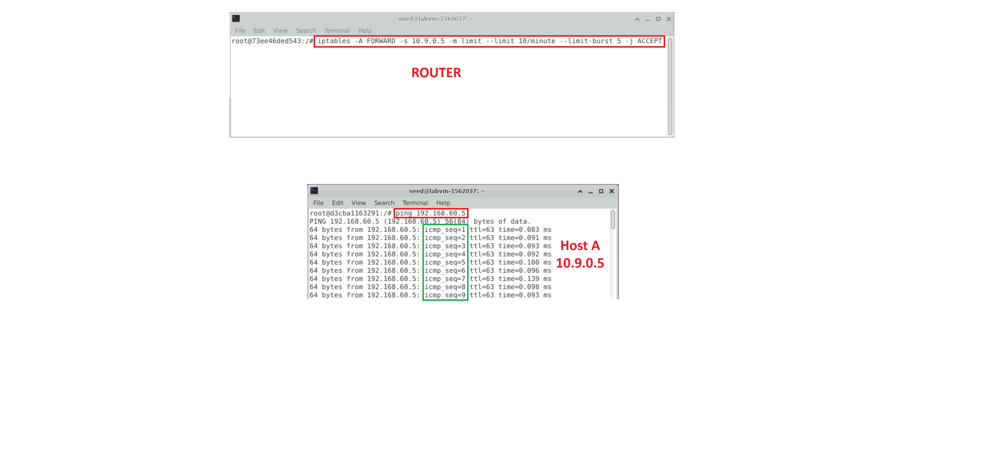
- This one with the DROP rule.
   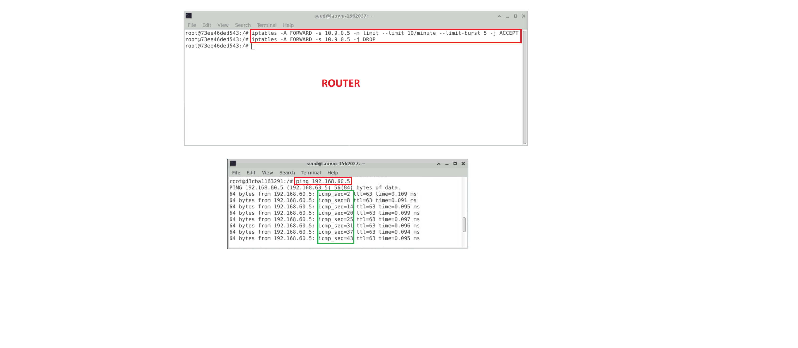

### You have successfully completed the lab
Before validating your lab, make sure that you have exited all of your containers:
```
exit
```

To confirm your completion and receive credit for this task, go to the **Lab Validation** tab in the navigation bar at the top of this guide and click the **Validate** button for each task. If your task validation failed, read the validation information for more details, and try the steps in the task again.

**Important:** for the validation to succeed, you must have run the commands exactly as written in the lab, with all syntax and punctuation matching. 
