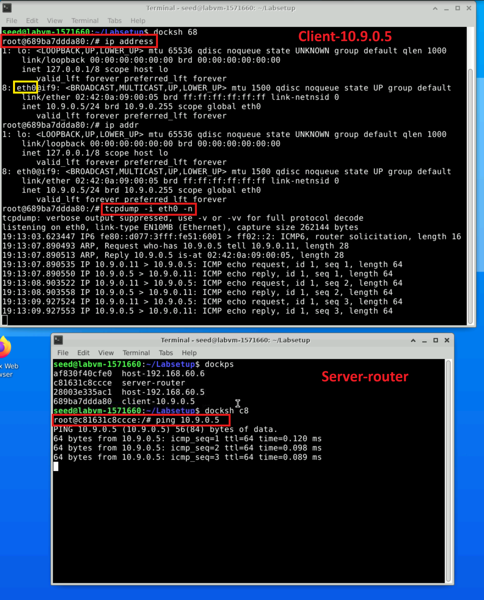
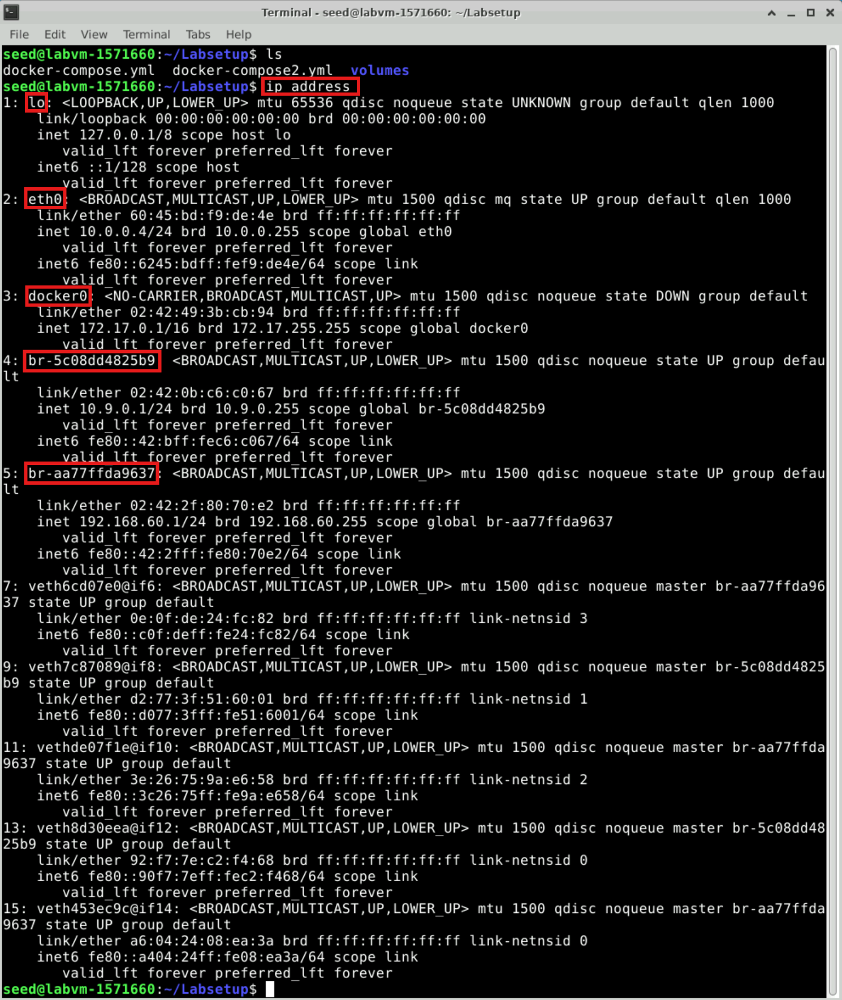
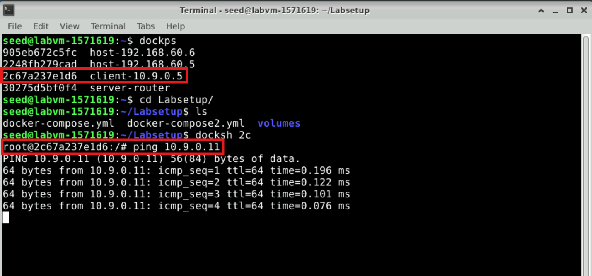
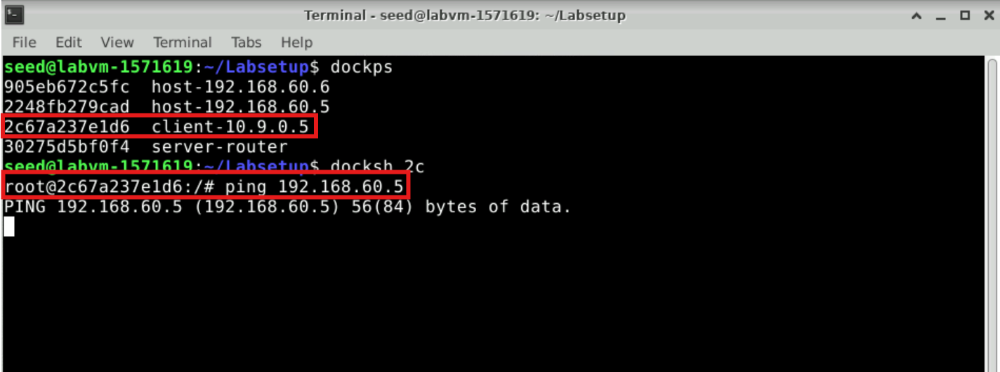
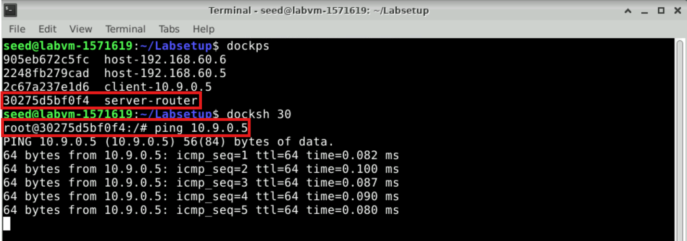
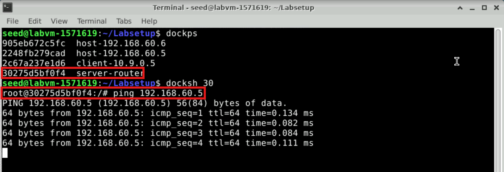

# Lab 8: VPN Lab: The Container Version

>Copyright © 2020 by Wenliang Du.
>This work is licensed under a Creative Commons Attribution-NonCommercial-ShareAlike 4.0 International License. If you remix, transform, or build upon the material, this copyright notice must be left intact, or reproduced in a way that is reasonable to the medium in which the work is being re-published.

## Overview

A Virtual Private Network (VPN) is a private network built on top of a public network, usually the Internet.
Computers inside a VPN can communicate securely, just like if they were on a real private network that is
physically isolated from outside, even though their traffic may go through a public network. A VPN enables
employees to securely access a company’s intranet while traveling; it also allows companies to expand their
private networks to places across the country and around the world.
The objective of this lab is to help students understand how a VPN works. We focus on a specific type of
VPN (the most common type), which is built on top of the transport layer. We will build a very simple VPN
from scratch, and use the process to illustrate how each piece of the VPN technology works. A real VPN
program has two essential pieces: tunneling and encryption. This lab only focuses on the tunneling part,
helping students understand the tunneling technology, so the tunnel in this lab is not encrypted. The lab covers the following topics:

- Virtual Private Network
- The TUN/TAP virtual interface
- IP tunneling
- Routing

## Task 1: Network Setup

We will create a VPN tunnel between a computer (client) and a gateway, allowing the computer to securely
access a private network via the gateway. We need at least three machines: VPN client (also serving as
HostU), VPN server (the router/gateway), and a host in the private network (HostV). The network setup is
depicted in Figure 1.


`Figure 1: Lab environment setup`

In practice, the VPN client and VPN server are connected via the Internet. For the sake of simplicity,
we directly connect these two machines to the same LAN in this lab, i.e., this LAN simulates the Internet.
The third machine, HostV, is a computer inside the private network. Users on HostU (outside of the
private network) want to communicate with HostV via the VPN tunnel. To simulate this setup, we connect
HostV to VPN Server (also serving as a gateway). In such a setup, HostV is not directly accessible from
the Internet; nor is it directly accessible from HostU.

### Lab environment setup
Files needed for this lab are included in Labsetup.zip, which can be fetched by running the following commands.

```
# Download the lab setup files
sudo wget https://seedsecuritylabs.org/Labs_20.04/Files/VPN_Tunnel/Labsetup.zip

# Unzip the lab setup files
sudo unzip Labsetup.zip
```
Move into the extracted Labsetup folder, where you will find the `docker-compose.yml` file and other necessary files.

```
# Enter the Labsetup folder
cd Labsetup
ls
```

We have created aliases for our commonly used commands related to Docker and Compose in the `.bashrc` file.

#### Build the Docker Container
Use Docker Compose to build the container image. This step prepares the environment for running your web server with the required configurations.

```
# Build the Docker container
docker-compose build
```
```
# OR use the alias
dcbuild
```

#### Start the Docker Container
This command initializes and runs the container based on the configurations specified in the `docker-compose.yml` file.

```
# Start the Docker container
docker-compose up -d
```
```
# OR use the alias
dcup -d
```

#### Stop and Shut Down the Docker Container
When you’re finished or need to reset the environment, you should shut down the running container to release resources.
Don't do this now, as you need the Docker container up for this lab.

```
# Stop and shut down the Docker container
docker-compose down
```
```
# OR use the alias
dcdown
```
 
All the containers will be running in the background. To run commands on a container, we often need
to get a shell on that container. We first need to use the `docker ps` command to find out the ID of
the container, and then use `docker exec` to start a shell on that container. We have also created aliases for
them in the `.bashrc` file.

#### List Running Docker Containers
Use the alias `dockps` to view a list of running containers, displaying each container's ID and name in a simplified format.

```
dockps
```

#### Output
The output will list all running Docker containers, each with its unique ID and assigned name. An example output might look like this:

```
b1004832e275 hostA-10.9.0.5
0af4ea7a3e2e hostB-10.9.0.6
9652715c8e0a hostC-10.9.0.7
```
Each line includes the container ID and its corresponding name (in this case, hostA, hostB, and hostC), along with their assigned IP addresses.

#### Access a Specific Container’s Shell
To open a shell inside a specific container, use the alias `docksh` followed by the first few characters of the container's ID. For example, to access hostC, use the ID prefix 96 (from the third line in the previous output).

```
docksh 96
```

#### Output
You will be logged into a shell session inside the specified container. The prompt will change to show the container ID, indicating that you are now inside the container:

```
root@9652715c8e0a:/#
```

**Note: If a Docker command requires the container ID, you only need to type the first few characters, as long as they are unique among all running containers.**


### Shared folder
In this lab, we need to write our own code and run it inside containers. Code editing is
more convenient inside the VM than in containers, because we can use our favorite editors. In order for the
VM and container to share files, we have created a shared folder between the VM and the container using
the Docker volumes. If you look at the Docker Compose file, you will find out that we have added the
following entry to some of the containers. It indicates mounting the `./volumes` folder on the host machine
(i.e., the VM) to the `/volumes` folder inside the container. We will write our code in the `./volumes`
folder (on the VM), so they can be used inside the containers.

```
volumes:
    - ./volumes:/volumes
```

### Packet sniffing
Being able to sniff packets is very important in this lab, because if things do not go
as expected, being able to look at where packets go can help us identify the problems. There are several
different ways to do packet sniffing:

- Running `tcpdump` on containers. We have already installed `tcpdump` on each container. To sniff
    the packets going through a particular interface, we just need to find out the interface name, and then
    do the following (assume that the interface name is `eth0`):

  ```
  tcpdump -i eth0 -n
  ```
  

  
  It should be noted that, due to the isolation created by Docker, when we run `tcpdump` inside a container, we can only sniff the packets going in and out of this container. We won’t be able to sniff the packets between    other containers. However, if a container uses the host mode in its network setup, it can sniff other containers’ packets.

- Running `tcpdump` on the VM. If we run `tcpdump` on the VM, we do not have the restriction on the
    containers, and we can sniff all the packets going among containers. The interface name for a network
    is different on the VM than on the container. On containers, each interface name usually starts with
    `eth`; on the VM, the interface name for the network created by Docker starts with `br-`, followed by
    the ID of the network. You can always use the `ip address` command to get the interface name on
    the VM and containers.
  
   

  - We can also run Wireshark on the VM to sniff packets. Similar to `tcpdump`, we need to select what
    interface we want Wireshark to sniff on.

### Testing
Before moving on to the lab tasks, we want to confirm that the lab environment is set up correctly
and the following actions are correct for our setup:

- HostU can communicate with VPN Server.
- VPN Server can communicate with HostV.
- HostU should not be able to communicate with HostV.

Please conduct the following tests to ensure that the lab environment is set up correctly:
- Run `tcpdump` on the router, and sniff the traffic on each of the networks. Show that you can capture
    packets.

     - From HostU (Client), ping the VPN  Server to confirm communication using `ping 10.9.0.11`
     
        
       
     - From HostU (Client), attempt to ping HostV using `ping 192.168.60.5` to ensure it is not accessible.
     
        
     
     - From VPN Server (Router), ping HostU to verify connectivity using `ping 10.9.0.5`.
     
        
       
     - From VPN Server (Router), ping HostV to confirm access to the private network using `ping 192.168.60.5`.
     
        

### Lab Environment Setup Complete

Your lab environment setup is now complete, and you're ready to begin your lab! Navigate to the next page to get started.
