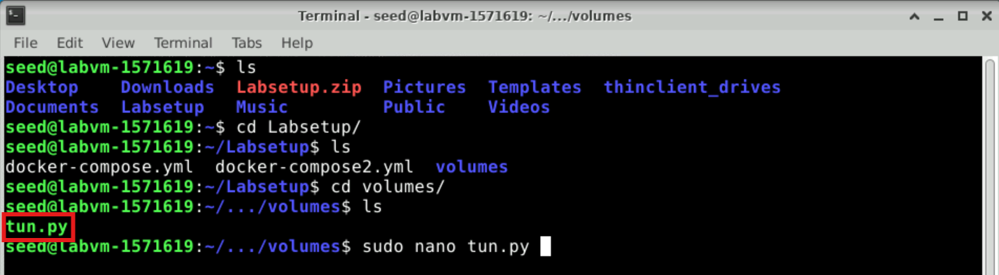
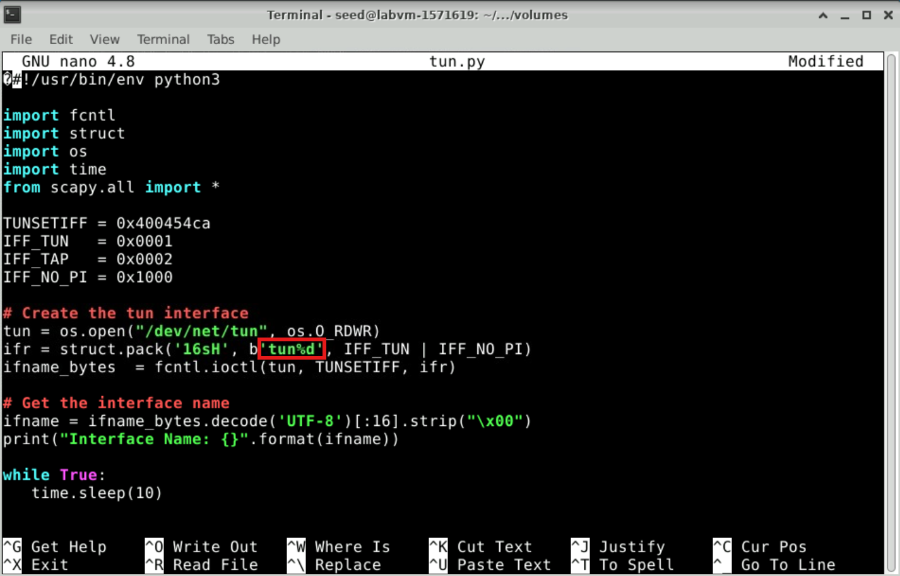
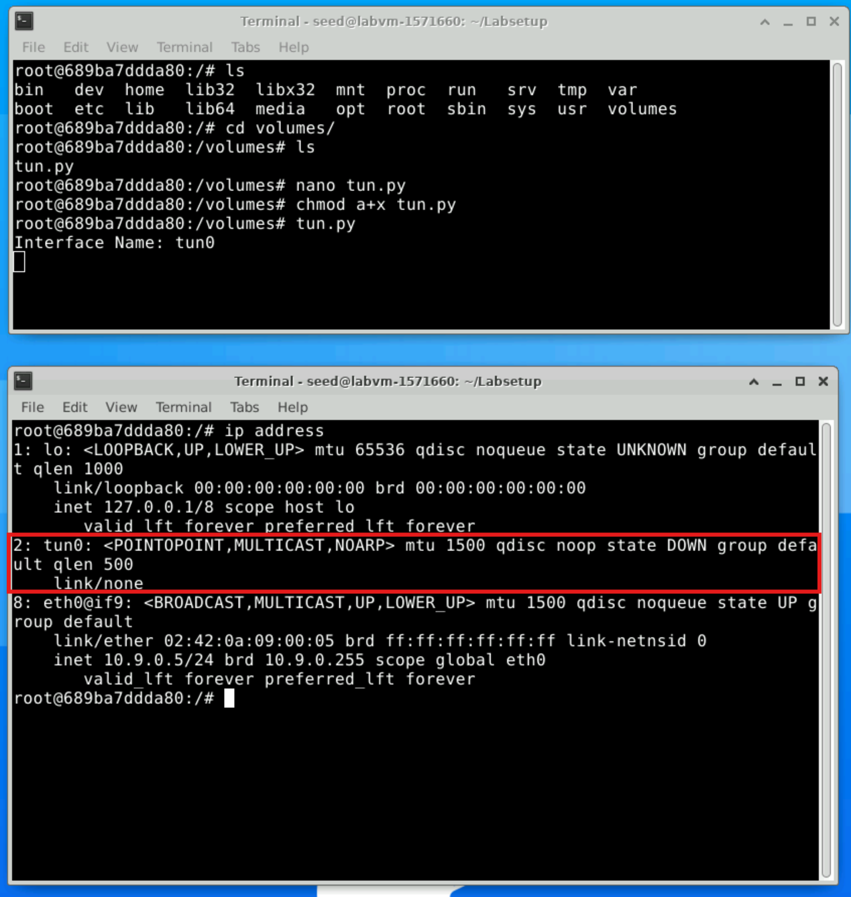
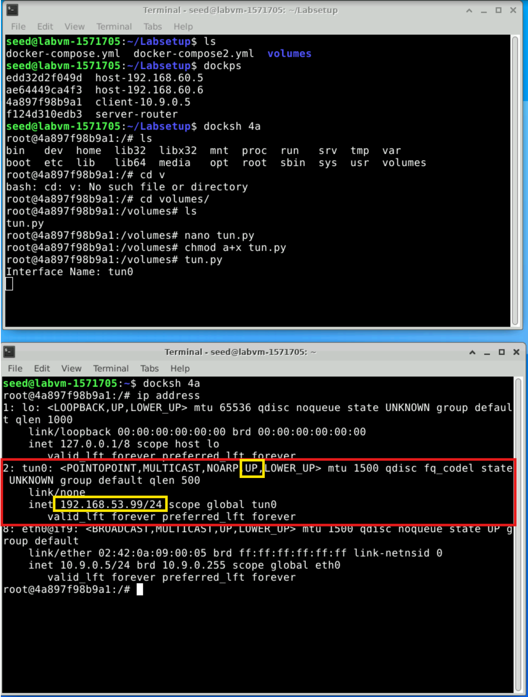
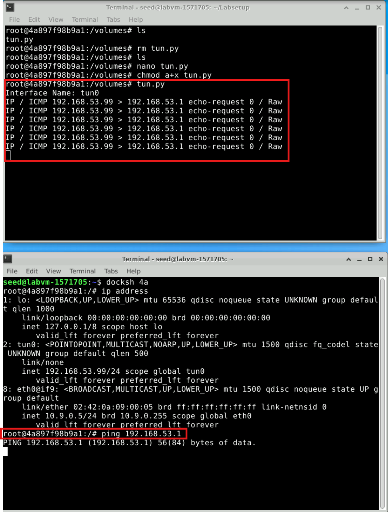
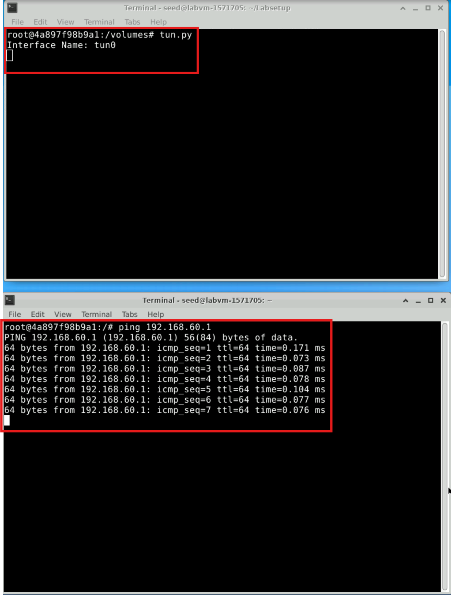
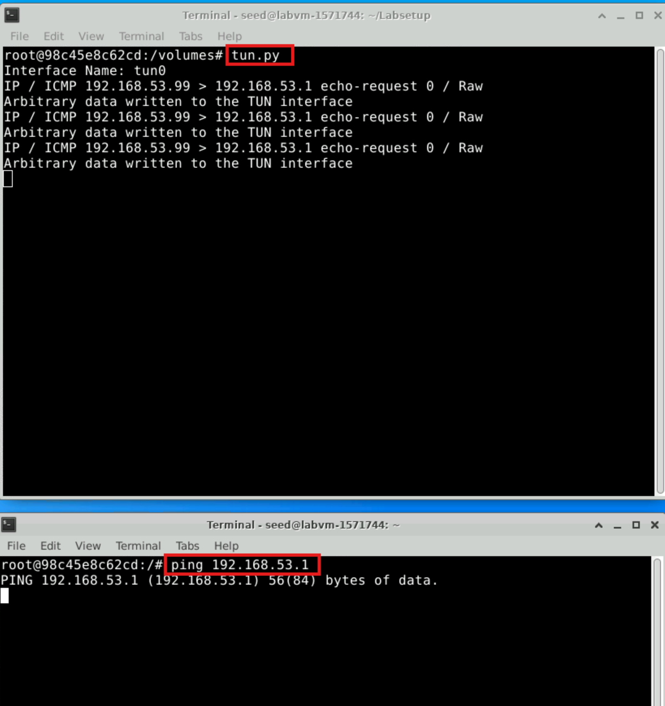

## 3 Task 2: Create and Configure TUN Interface

The VPN tunnel that we are going to build is based on the TUN/TAP technologies. TUN and TAP are virtual
network kernel drivers; they implement network device that are supported entirely in software. TAP (as in
network tap) simulates an Ethernet device and it operates with layer-2 packets such as Ethernet frames;
TUN (as in network TUNnel) simulates a network layer device and it operates with layer-3 packets such as
IP packets. With TUN/TAP, we can create virtual network interfaces.
A user-space program is usually attached to the TUN/TAP virtual network interface. Packets sent by an
operating system via a TUN/TAP network interface are delivered to the user-space program. On the other
hand, packets sent by the program via a TUN/TAP network interface are injected into the operating system
network stack. To the operating system, it appears that the packets come from an external source through
the virtual network interface.
When a program is attached to a TUN/TAP interface, IP packets sent by the kernel to this interface will
be piped into the program. On the other hand, IP packets written to the interface by the program will be
piped into the kernel, as if they came from the outside through this virtual network interface. The program
can use the standard read() and write() system calls to receive packets from or send packets to the
virtual interface.
The objective of this task is to get familiar with the TUN/TAP technology. We will conduct several
experiments to learn the technical details of the TUN/TAP interface. We will use the following Python
program as the basis for the experiments, and we will modify this base code throughout this lab. The code
is already included in the `volumes` folder in the zip file.

`Listing 1: Creating a TUN interface (tun.py)`

```
#!/usr/bin/env python3

import fcntl
import struct
import os
import time
from scapy.all import *

TUNSETIFF = 0x400454ca
IFF_TUN   = 0x0001
IFF_TAP   = 0x0002
IFF_NO_PI = 0x1000

# Create the tun interface
tun = os.open("/dev/net/tun", os.O_RDWR)
ifr = struct.pack('16sH', b'tun%d', IFF_TUN | IFF_NO_PI)
ifname_bytes  = fcntl.ioctl(tun, TUNSETIFF, ifr)

# Get the interface name
ifname = ifname_bytes.decode('UTF-8')[:16].strip("\x00")
print("Interface Name: {}".format(ifname))

while True:
   time.sleep(10)
```

### 3.1 Task 2.a: Name of the Interface

We will run the `tun.py` program on HostU. Make the `tun.py` program executable and run it using root privileges. 
To modify and prepare `tun.py`, update the program to set a custom prefix for the interface name, as shown in the following figure. You can access the Python file by navigate to the `tun.py` file in the shared directory `volume`, as shown in the figure.

  

You need to update the following line in the program `ifr = struct.pack('16sH', b'tun%d', IFF_TUN | IFF_NO_PI)`.

  

```
// Make the Python program executable
# chmod a+x tun.py

// Run the program using the root privilege
# tun.py
```

Once the program is executed, it will block. You can go to another terminal and get a new shell on the
container. Then print out all the interfaces on the machine. Please report your observation after running the
following command:

```
# ip address
```
  

You should be able to find an interface called `tun0`. Your job in this task is to change the `tun.py`
program, so instead of using `tun` as the prefix of the interface name, use your last name as the prefix. For
example, if your last name is smith, you should use smith as the prefix. If your last name is long, you can
use the first five characters. Please show your results.

### 3.2 Task 2.b: Set up the TUN Interface

At this point, the TUN interface is not usable, because it has not been configured yet. There are two things
that we need to do before the interface can be used. First, we need to assign an IP address to it. Second, we
need to bring up the interface, because the interface is still in the down state. We can use the following two
commands for the configuration:

```
// Assign IP address to the interface
# ip addr add 192.168.53.99/24 dev tun


// Bring up the interface
# ip link set dev tun0 up
```

To make life easier, students can add the following two lines of code totun.py, so the configuration
can be automatically performed by the program.

```
os.system("ip addr add 192.168.53.99/24 dev {}".format(ifname))
os.system("ip link set dev {} up".format(ifname))
```

The following is the updated code with crating the TUN interface:

```
#!/usr/bin/env python3

import fcntl
import struct
import os
import time
from scapy.all import *

TUNSETIFF = 0x400454ca
IFF_TUN   = 0x0001
IFF_TAP   = 0x0002
IFF_NO_PI = 0x1000

# Create the tun interface
tun = os.open("/dev/net/tun", os.O_RDWR)
ifr = struct.pack('16sH', b'tun%d', IFF_TUN | IFF_NO_PI)
ifname_bytes  = fcntl.ioctl(tun, TUNSETIFF, ifr)

# Get the interface name
ifname = ifname_bytes.decode('UTF-8')[:16].strip("\x00")
print("Interface Name: {}".format(ifname))

# Configure the TUN interface
os.system("ip addr add 192.168.53.99/24 dev {}".format(ifname))
os.system("ip link set dev {} up".format(ifname))

while True:
   time.sleep(10)
```
After running the two commands above and the `ip address` command again, the TUN interface changes from DOWN to UP, and it is assigned the IP address 192.168.53.99/24. This makes the interface active and ready to send or receive packets, enabling it to function as part of the VPN tunnel.

  

### 3.3 Task 2.c: Read from the TUN Interface

In this task, we will read from the TUN interface. Whatever coming out from the TUN interface is an IP
packet. We can cast the data received from the interface into a Scapy IP object, so we can print out each
field of the IP packet. Please use the following while loop to replace the one intun.py:

```
while True:
    # Get a packet from the tun interface
    packet = os.read(tun, 2048)
    if packet:
        ip = IP(packet)
        print(ip.summary())
```

This is the updated code:

```
#!/usr/bin/env python3

import fcntl
import struct
import os
import time
from scapy.all import *

TUNSETIFF = 0x400454ca
IFF_TUN   = 0x0001
IFF_TAP   = 0x0002
IFF_NO_PI = 0x1000

# Create the tun interface
tun = os.open("/dev/net/tun", os.O_RDWR)
ifr = struct.pack('16sH', b'tun%d', IFF_TUN | IFF_NO_PI)
ifname_bytes  = fcntl.ioctl(tun, TUNSETIFF, ifr)

# Get the interface name
ifname = ifname_bytes.decode('UTF-8')[:16].strip("\x00")
print("Interface Name: {}".format(ifname))

# Configure the TUN interface
os.system("ip addr add 192.168.53.99/24 dev {}".format(ifname))
os.system("ip link set dev {} up".format(ifname))

while True:
    # Get a packet from the tun interface
    packet = os.read(tun, 2048)
    if packet:
        ip = IP(packet)
        print(ip.summary())
```

After running the revised `tun.py` program on HostU and configure the TUN interface with the assigned IP address (192.168.53.99/24). You can notice the following:

- When you ping a host in the 192.168.53.0/24 network, the tun.py program captures the ICMP echo request packets sent by the ping command. The program prints packet summaries, including the source IP, destination IP, and protocol details. This happens because packets in the 192.168.53.0/24 network are routed through the TUN interface.
 
  
  
- When you ping a host in the 192.168.60.0/24 network, the tun.py program does not capture any packets. This is because packets destined for the 192.168.60.0/24 network are not routed through the TUN interface, so the program does not process them.

  

### 3.4 Task 2.d: Write to the TUN Interface

In this task, we will write to the TUN interface. Since this is a virtual network interface, whatever is written
to the interface by the application will appear in the kernel as an IP packet.
We will modify the `tun.py` program, so after getting a packet from the TUN interface, we construct a
new packet based on the received packet. We then write the new packet to the TUN interface. How the new
packet is constructed is up to students. The code in the following shows an example of how to write an IP
packet to the TUN interface.

```
# Send out a spoof packet using the tun interface
newip = IP(src=’1.2.3.4’, dst=ip.src)
newpkt = newip/ip.payload
os.write(tun, bytes(newpkt))
```

This is the modified `tun.py` code:

```
#!/usr/bin/env python3

import fcntl
import struct
import os
import time
from scapy.all import *

TUNSETIFF = 0x400454ca
IFF_TUN   = 0x0001
IFF_TAP   = 0x0002
IFF_NO_PI = 0x1000

# Create the tun interface
tun = os.open("/dev/net/tun", os.O_RDWR)
ifr = struct.pack('16sH', b'tun%d', IFF_TUN | IFF_NO_PI)
ifname_bytes  = fcntl.ioctl(tun, TUNSETIFF, ifr)

# Get the interface name
ifname = ifname_bytes.decode('UTF-8')[:16].strip("\x00")
print("Interface Name: {}".format(ifname))

# Configure the TUN interface
os.system("ip addr add 192.168.53.99/24 dev {}".format(ifname))
os.system("ip link set dev {} up".format(ifname))

while True:
    # Get a packet from the tun interface
    packet = os.read(tun, 2048)
    if packet:
        ip = IP(packet)
        print(ip.summary())

        # Send out a spoofed packet using the TUN interface
        if ip.proto == 1:  # ICMP protocol
           newip = IP(src='1.2.3.4', dst=ip.src)
           newpkt = newip / ip.payload
           os.write(tun, bytes(newpkt))

    # Write arbitrary data for testing 
    print("Arbitrary data written to the TUN interface")
```

  

The tun.py code was implemented to process ICMP echo requests and handle packet modification through the TUN interface. It reads packets, identifies ICMP echo requests, and constructs spoofed packets with a hardcoded source IP address (1.2.3.4) before writing them back to the interface. The program was tested by pinging the TUN interface (192.168.53.1) and successfully logged the receipt of ICMP packets and transmission of spoofed packets. While it demonstrates basic packet handling, it does not fully implement true ICMP echo reply behavior. Additionally, the program logs writing arbitrary data.

