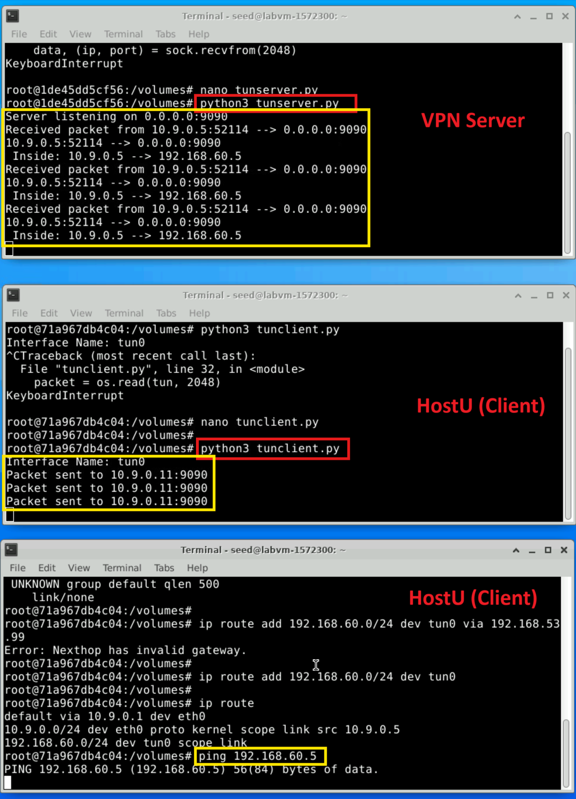
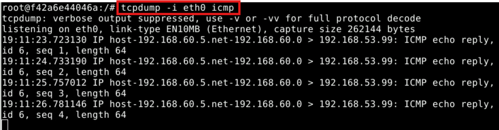

## Task 3: Send the IP Packet to VPN Server Through a Tunnel

In this task, we will put the IP packet received from the TUN interface into the UDP payload field of a new
IP packet, and send it to another computer. Namely, we place the original packet inside a new packet. This
is called IP tunneling. The tunnel implementation is just standard client/server programming. It can be built
on top of TCP or UDP. In this task, we will use UDP. Namely, we put an IP packet inside the payload field
of a UDP packet.

### The server program `tunserver.py`
We will run the `tunserver.py` program on the VPN Server. This
program is just a standard UDP server program. It listens to port 9090 and prints out whatever is received.
The program assumes that the data in the UDP payload field is an IP packet, so it casts the payload to a
ScapyIPobject, and prints out the source and destination IP address of the enclosed IP packet.

Create the file `tunserver.py` in the `volumes` folder, then make the program executable. 

Listing 2: `tunserver.py`

```
#!/usr/bin/env python3

from scapy.all import *

IP_A = "0.0.0.0"
PORT = 9090

sock = socket.socket(socket.AF_INET, socket.SOCK_DGRAM)
sock.bind((IP_A, PORT))

while True:
    data, (ip, port) = sock.recvfrom(2048)
    print("{}:{} --> {}:{}".format(ip, port, IP_A, PORT))
    pkt = IP(data)
    print(" Inside: {} --> {}".format(pkt.src, pkt.dst))
```

### Implement the client program `tunclient.py`
First, we need to modify the TUN program `tun.py`.
Let’s rename it, and call it `tunclient.py`. Sending data to another computer using UDP can be done
using the standard socket programming.
Replace the while loop in the program with the following: The `SERVER_IP` and `SERVER_PORT` should be replaced with the actual IP address and port number of the server program running on VPN
Server.

```
# Create UDP socket
sock = socket.socket(socket.AF_INET, socket.SOCK_DGRAM)

while True:
    # Get a packet from the tun interface
    packet = os.read(tun, 2048)
    if packet:
        # Send the packet via the tunnel
        sock.sendto(packet, (SERVER_IP, SERVER_PORT))
```

The updated `tunclient.py` code should be something like this:
```
#!/usr/bin/env python3

import fcntl
import struct
import os
import socket
from scapy.all import *

TUNSETIFF = 0x400454ca
IFF_TUN   = 0x0001
IFF_TAP   = 0x0002
IFF_NO_PI = 0x1000

# Create the TUN interface
tun = os.open("/dev/net/tun", os.O_RDWR)
ifr = struct.pack('16sH', b'tun%d', IFF_TUN | IFF_NO_PI)
ifname_bytes = fcntl.ioctl(tun, TUNSETIFF, ifr)

# Get the interface name
ifname = ifname_bytes.decode('UTF-8')[:16].strip("\x00")
print(f"Interface Name: {ifname}")

# Configure the TUN interface
os.system(f"ip addr add 192.168.53.99/24 dev {ifname}")
os.system(f"ip link set dev {ifname} up")

# Client Configuration
SERVER_IP = "10.9.0.11"
SERVER_PORT = 9090

# Create a UDP socket
sock = socket.socket(socket.AF_INET, socket.SOCK_DGRAM)

while True:
    # Read a packet from the TUN interface
    packet = os.read(tun, 2048)
    if packet:
        print(f"Packet read from TUN interface: {IP(packet).summary()}")
        
        # Send the packet to the VPN server
        sock.sendto(packet, (SERVER_IP, SERVER_PORT))
        print(f"Packet sent to {SERVER_IP}:{SERVER_PORT}")
```


### Testing
To test whether the tunnel works, first run the `tunserver.py` program on the VPN Server. The server will listen on port `9090` for incoming UDP packets. Next, run the `tunclient.py` program on HostU. The client will configure the TUN interface (`[last_name]0`), capture packets sent to it, encapsulate them in UDP packets, and send them to the VPN Server. 
To test the tunnel, ping any IP address in the `192.168.53.0/24` network (e.g., `192.168.53.1`) from HostU. On the VPN Server, the `tunserver.py` program will print logs showing the source and destination IPs of the received packets. For example, you may see output like this: `10.9.0.11:12345 --> 0.0.0.0:9090` and `Inside: 192.168.53.99 --> 192.168.53.1`. This confirms that the ICMP echo request packet was successfully forwarded from the TUN interface on HostU through the tunnel to the VPN Server, where it was received and processed.

To achieve the ultimate goal of accessing hosts inside the private network `192.168.60.0/24` using the tunnel, you need to route packets destined for this network to the TUN interface on HostU. This can be done by adding a route with the following command on HostU (replacing `tun0` with your interface name): 
```
ip route add 192.168.60.0/24 dev tun0
```
Once this route is added, any packets sent to the `192.168.60.0/24` network will be captured by `tunclient.py`, encapsulated in UDP, and sent to the VPN Server. When you ping a host in the `192.168.60.0/24` network, such as HostV (`192.168.60.5`), the VPN Server will log the packet details, confirming that the ICMP echo request packet was received through the tunnel.

If the ICMP packets do not appear on the VPN Server, ensure the TUN interface on HostU is up by running `ip link set dev tun0 up` and verify the route configuration. The output on the VPN Server will show packets received through the tunnel, demonstrating that the tunnel is correctly forwarding packets for the private network.

  

<!---
Run the `tunserver.py` program on VPN Server, and then run `tunclient.py` on HostU. To test whether the tunnel works or not,ping any IP address belonging to the 192.168.53.0/
network. What is printed out on VPN Server? Why?
Our ultimate goal is to access the hosts inside the private network 192.168.60.0/24 using the
tunnel. Let us ping HostV, and see whether the ICMP packet is sent to VPN Server through the tunnel.
If not, what are the problems? You need to solve this problem, so the ping packet can be sent through
the tunnel. This is done through routing, i.e., packets going to the 192.168.60.0/24 network should
be routed to the TUN interface and be given to the `tunclient.py` program. The following command
shows how to add an entry to the routing table:

```
# ip route add <network> dev <interface> via <router ip>
```

Please demonstrate that when you ping an IP address in the192.168.60.0/
network, the ICMP packets are received by `tunserver.py` through the tunnel.
--->

## Task 4: Set Up the VPN Server

This task involves modifying the VPN Server program `tunserver.py` so that it can process packets received from the tunnel, feed them to the kernel through a TUN interface, and forward them to their final destination. You will also enable IP forwarding to ensure the server can act as a gateway. This needs to be done through a TUN interface, just like what we did in Task 2. 

Before running the modified `tunserver.py`, we need to enable the IP forwarding. Unless specifi-
cally configured, a computer will only act as a host, not as a gateway. VPN Server needs to forward packets
between the private network and the tunnel, so it needs to function as a gateway. We need to enable the IP
forwarding for a computer to behave like a gateway. IP forwarding has already been enabled on the router
container. You can see in `docker-compose.yml` that the router container has the following entry:

```
sysctls:
    - net.ipv4.ip_forward=1
```

Run the following command to verify the current IP forwarding status:

```
sysctl net.ipv4.ip_forward
```

Then, you need to modify `tunserver.py`, so it can do the following:

- Create a TUN interface and configure it.
- Get the data from the socket interface; treat the received data as an IP packet.
- Write the packet to the TUN interface.

The updated `tunserver.py` code will be like this:

```
#!/usr/bin/env python3

import fcntl
import struct
import os
import socket
from scapy.all import *

TUNSETIFF = 0x400454ca
IFF_TUN   = 0x0001
IFF_TAP   = 0x0002
IFF_NO_PI = 0x1000

# Create the TUN interface
tun = os.open("/dev/net/tun", os.O_RDWR)
ifr = struct.pack('16sH', b'tun%d', IFF_TUN | IFF_NO_PI)
ifname_bytes = fcntl.ioctl(tun, TUNSETIFF, ifr)

# Get the interface name
ifname = ifname_bytes.decode('UTF-8')[:16].strip("\x00")
print(f"Interface Name: {ifname}")

# Configure the TUN interface
os.system(f"ip addr add 192.168.60.1/24 dev {ifname}")
os.system(f"ip link set dev {ifname} up")

# UDP socket for receiving packets from the client
IP_A = "0.0.0.0"
PORT = 9090
sock = socket.socket(socket.AF_INET, socket.SOCK_DGRAM)
sock.bind((IP_A, PORT))
print(f"Server listening on {IP_A}:{PORT}")

while True:
    # Receive a packet from the tunnel
    data, (ip, port) = sock.recvfrom(2048)
    print(f"Received packet from {ip}:{port}")

    # Parse the UDP payload as an IP packet
    pkt = IP(data)
    print(f"Inside Packet: {pkt.src} --> {pkt.dst}")

    # Write the packet to the TUN interface
    os.write(tun, bytes(pkt))
    print(f"Packet written to TUN interface: {ifname}")
```

Then, on the VPN Server, execute:

```
python3 tunserver.py
```

### Testing
The testing process confirmed that the setup was successful. ICMP echo request packets from HostU were sent through the tunnel to the VPN Server and eventually reached HostV. Using `tcpdump` on HostV, it was verified that the ICMP packets arrived as expected, demonstrating that the VPN Server successfully forwarded the packets from the TUN interface to their destination. Although HostV responded to the ICMP echo requests with echo replies, the replies did not return to HostU because reverse tunneling has not yet been configured. This behaviour aligns with the current setup, where the focus is on ensuring that packets can traverse the tunnel and reach their intended destination. The following `tcpdump` output shows that the ICMP packets were correctly delivered to HostV.

<!---
If everything is set up properly, we can ping HostV from HostU. The ICMP echo request
packets should eventually arrive at `HostV` through the tunnel. Please show your proof. It should be noted
that although HostV will respond to the ICMP packets, the reply will not get back to HostU, because we
have not set up everything yet. Therefore, for this task, it is sufficient to show (using Wireshark or tcpdump)
that the ICMP packets have arrived at HostV.
--->

  


## Task 5: Handling Traffic in Both Directions

After getting to this point, one direction of your tunnel is complete, i.e., we can send packets from HostU
to HostV via the tunnel. If we look at the Wireshark trace on HostV, we can see that HostV has sent out
the response, but the packet gets dropped somewhere. This is because our tunnel is only one directional; we
need to set up its other direction, so returning traffic can be tunneled back to Host U.
To achieve that, our TUN client and server programs need to read data from two interfaces, the TUN
interface and the socket interface. All these interfaces are represented by file descriptors, so we need to
monitor them to see whether there are data coming from them. One way to do that is to keep polling them,
and see whether there are data on each of the interfaces. The performance of this approach is undesirable,
because the process has to keep running in an idle loop when there is no data. Another way is to read from
an interface. By default, read is blocking, i.e., the process will be suspended if there are no data. When
data become available, the process will be unblocked, and its execution will continue. This way, it does not
waste CPU time when there is no data.

The read-based blocking mechanism works well for one interface. If a process is waiting on multiple
interfaces, it cannot block on just one of the interfaces. It has to block on all of them altogether. Linux has a
system call called `select()`, which allows a program to monitor multiple file descriptors simultaneously.
To use `select()`, we need to store all the file descriptors to be monitored in a set, and then we give the
set to the `select()` system call, which will block the process until data are available on one of the file
descriptors in the set. We can check which file descriptor has received data. In the following Python code
snippet, we use `select()` to monitor a TUN and a socket file descriptor.

```
# We assume that sock and tun file descriptors have already been created.

while True:
    # this will block until at least one interface is ready
    ready, _, _ = select.select([sock, tun], [], [])
    
    for fd in ready:
        if fd is sock:
            data, (ip, port) = sock.recvfrom(2048)
            pkt = IP(data)
            print("From socket <==: {} --> {}".format(pkt.src, pkt.dst))
            ... (code needs to be added by students) ...
    
    if fd is tun:
        packet = os.read(tun, 2048)
        pkt = IP(packet)
        print("From tun ==>: {} --> {}".format(pkt.src, pkt.dst))
        ... (code needs to be added by students) ...
```

Below are the updated `tunserver.py` and `tunclient.py` programs for handling bidirectional traffic.

`tunserver.py`

```
#!/usr/bin/env python3

import fcntl
import struct
import os
import socket
import select
from scapy.all import *

TUNSETIFF = 0x400454ca
IFF_TUN = 0x0001
IFF_NO_PI = 0x1000

# Create the TUN interface
tun = os.open("/dev/net/tun", os.O_RDWR)
ifr = struct.pack('16sH', b'tun%d', IFF_TUN | IFF_NO_PI)
ifname_bytes = fcntl.ioctl(tun, TUNSETIFF, ifr)

# Get the interface name
ifname = ifname_bytes.decode('UTF-8')[:16].strip("\x00")
print(f"Interface Name: {ifname}")

# Configure the TUN interface
os.system(f"ip addr add 192.168.60.1/24 dev {ifname}")
os.system(f"ip link set dev {ifname} up")
print(f"Configured {ifname} with IP 192.168.60.1/24 and brought UP.")

# Create a UDP socket to communicate with the client
IP_A = "0.0.0.0"
PORT = 9090
sock = socket.socket(socket.AF_INET, socket.SOCK_DGRAM)
sock.bind((IP_A, PORT))
print(f"Server listening on {IP_A}:{PORT}")

while True:
    # Monitor both the TUN interface and the UDP socket
    ready, _, _ = select.select([sock, tun], [], [])

    for fd in ready:
        if fd is sock:  # Data received from the client
            data, (ip, port) = sock.recvfrom(2048)
            pkt = IP(data)
            print(f"From socket <==: {pkt.src} --> {pkt.dst}")

            # Write the packet to the TUN interface
            os.write(tun, bytes(pkt))
            print(f"Packet written to TUN interface: {pkt.src} --> {pkt.dst}")

        if fd is tun:  # Data received from the TUN interface
            packet = os.read(tun, 2048)
            pkt = IP(packet)
            print(f"From tun ==>: {pkt.src} --> {pkt.dst}")

            # Send the packet back to the client via UDP
            sock.sendto(packet, (ip, port))
            print(f"Packet sent back to client: {pkt.src} --> {pkt.dst}")
```

`tunclient.py`

```
#!/usr/bin/env python3

import fcntl
import struct
import os
import socket
import select
from scapy.all import *

TUNSETIFF = 0x400454ca
IFF_TUN = 0x0001
IFF_NO_PI = 0x1000

# Create the TUN interface
tun = os.open("/dev/net/tun", os.O_RDWR)
ifr = struct.pack('16sH', b'tun%d', IFF_TUN | IFF_NO_PI)
ifname_bytes = fcntl.ioctl(tun, TUNSETIFF, ifr)

# Get the interface name
ifname = ifname_bytes.decode('UTF-8')[:16].strip("\x00")
print(f"Interface Name: {ifname}")

# Configure the TUN interface
os.system(f"ip addr add 192.168.53.99/24 dev {ifname}")
os.system(f"ip link set dev {ifname} up")
print(f"Configured {ifname} with IP 192.168.53.99/24 and brought UP.")

# Client Configuration
SERVER_IP = "10.9.0.11"  # Replace with the VPN Server's IP address
SERVER_PORT = 9090

# Create a UDP socket to communicate with the server
sock = socket.socket(socket.AF_INET, socket.SOCK_DGRAM)

while True:
    # Monitor both the TUN interface and the UDP socket
    ready, _, _ = select.select([sock, tun], [], [])

    for fd in ready:
        if fd is tun:  # Data received from the TUN interface
            packet = os.read(tun, 2048)
            pkt = IP(packet)
            print(f"From tun ==>: {pkt.src} --> {pkt.dst}")

            # Send the packet to the VPN server via UDP
            sock.sendto(packet, (SERVER_IP, SERVER_PORT))
            print(f"Packet sent to server: {pkt.src} --> {pkt.dst}")

        if fd is sock:  # Data received from the server
            data, _ = sock.recvfrom(2048)
            pkt = IP(data)
            print(f"From socket <==: {pkt.src} --> {pkt.dst}")

            # Write the packet to the TUN interface
            os.write(tun, bytes(pkt))
            print(f"Packet written to TUN interface: {pkt.src} --> {pkt.dst}")
```

<!--- Students can use the code above to replace the while loop in their TUN client and server programs.
The code is incomplete; students are expected to complete it.
--->

**Testing.** Once this is done, we should be able to communicate with MachineV from MachineU, and the
VPN tunnel (un-encrypted) is now complete. You can use `wireshark` about `ping` and
`telnet` commands.

 

### You have successfully completed the lab

Before validating your lab, make sure that you have exited all of your containers:
```
exit
```

To confirm your completion and receive credit for this task, go to the **Lab Validation** tab in the navigation bar at the top of this guide and click the **Validate** button for each task. If your task validation failed, read the validation information for more details, and try the steps in the task again.
